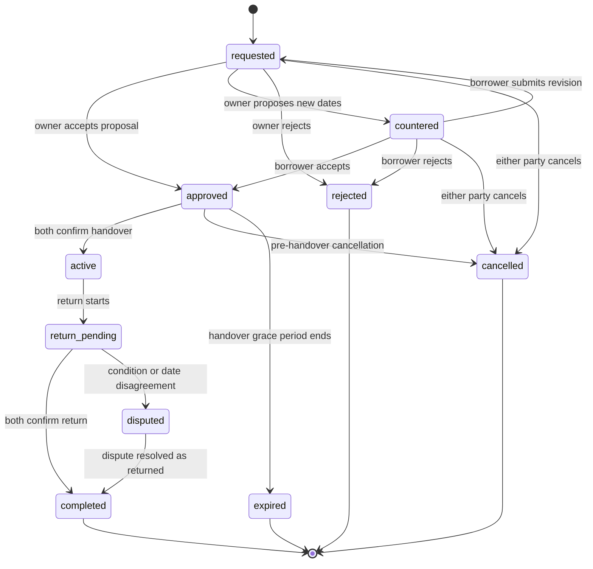

# [App Name] Product Requirements and Technical Design

**Document status:** Draft 0.1  
**Date:** 2026-08-12  
**Primary implementation target:** OpenAI Codex  
**Deployment target:** GitHub Pages frontend with Supabase backend

## 1. Purpose

This document is the product and technical source of truth for an installable, mobile-first tabletop lending application. The application lets authenticated users catalogue physical tabletop items, lend them to other users, track handover and return, record condition and damage, receive deadline notifications, and build a transparent reliability history.

Codex must implement the system in vertical slices. Each slice must include database migrations, Row Level Security policies, frontend behavior, automated tests, and user-facing error states.

## 2. Decisions Assumed for This Draft

The following decisions resolve ambiguities in the initial request. They can be changed before implementation.

1. The "mobile app" is an installable Progressive Web App (PWA), not an App Store or Play Store binary.
2. GitHub Pages hosts only the compiled static frontend. Supabase provides authentication, Postgres, Storage, Realtime, scheduled jobs, and Edge Functions.
3. Discord is the only login provider in the MVP.
4. Inventory and user profiles are visible only to signed-in users.
5. A loan can contain one or more items from one owner.
6. An owner can lend a complete set or selected components when component lending is enabled for that item.
7. There are no payments, deposits, shipping, insurance, or sales in the MVP.
8. Users arrange the physical exchange in a transaction-specific message thread.
9. Public profiles show only a coarse region. Exact addresses and contact details are not public.
10. Notifications include an in-app inbox and optional browser push notifications. Discord direct messages are not part of the MVP.
11. Reviews are blind until both parties submit a review or the review window closes.
12. The system records both borrower reliability and lender reliability, plus one combined profile score.
13. A missed deadline can affect either party. For example, a borrower can return late, and an owner can fail to confirm a return within the required response period.

## 3. Product Goals

### 3.1 Primary goals

- Let users maintain a useful catalogue of physical tabletop assets.
- Make availability and item condition clear before a request.
- Let users request one or more items for an agreed time range.
- Prevent conflicting approved loans.
- Record an auditable handover, extension, and return process.
- Notify both parties before and after important deadlines.
- Build a reliability score from completed-transaction reviews and objective deadline events.
- Protect user data with database-enforced authorization.
- Run as a static PWA on GitHub Pages without any server secret in the browser bundle.

### 3.2 Non-goals for the MVP

- Native iOS or Android store packages.
- Payments, deposits, escrow, insurance, or replacement claims.
- Shipping labels or courier tracking.
- Sale or trade listings.
- Automated dispute adjudication.
- A Discord bot or Discord direct-message notifications.
- Public anonymous inventory browsing.
- Real-time geographic tracking or exact public addresses.
- Multi-owner loans in one transaction.
- Organization, club, or campaign inventory management.

## 4. Terminology

- **Owner:** The user who owns an item and can approve or reject a request.
- **Borrower:** The user who requests and receives an item.
- **Item:** A lendable tabletop asset such as a miniature set, terrain set, map, tile set, book, accessory, tool, or game.
- **Component:** A listed part contained in an item, such as an individual miniature, tile, token, book volume, or terrain piece.
- **Loan:** The complete lifecycle from request through completion, cancellation, or dispute.
- **Date proposal:** A proposed start and due date pair. One proposal becomes the agreed schedule.
- **Condition report:** A timestamped report with item or component condition, quantities, damage notes, and evidence photos.
- **Reliability event:** A system-generated positive or negative event used by the automatic score component.
- **Overdue:** A derived condition where the agreed due time has passed and the loan has not reached a valid return stop point.

## 5. Users and Roles

### 5.1 Guest

A guest can:

- Open the landing page.
- Read a concise explanation of the service.
- Start Discord login.

A guest cannot read profiles, inventory, requests, loans, reviews, or messages.

### 5.2 Authenticated member

An authenticated member can:

- Maintain a profile and settings.
- Create, publish, update, archive, and temporarily disable owned items.
- Browse published items from other members.
- Request available items.
- Manage loans as owner or borrower.
- Send messages within a loan thread.
- Submit condition reports and confirmations.
- Submit reviews after completed loans.
- Block another user and report content or behavior.

### 5.3 System

The system can:

- Create profiles after first login.
- Validate and apply state transitions.
- Detect upcoming due dates and overdue loans.
- Create in-app notifications and send optional web push notifications.
- Create automatic reliability events.
- Recalculate reliability scores.
- Preserve immutable audit events.

### 5.4 Moderator

A minimal moderator role is recommended but can be deferred. A moderator can review reported content, suspend accounts, hide reviews, and resolve a disputed loan outcome. The MVP must still contain report and dispute records even if the first release uses direct database administration.

## 6. Functional Requirements

## 6.1 Authentication and session management

### AUTH-001 Discord login

The application shall provide a "Continue with Discord" action that starts Supabase OAuth with the Discord provider.

### AUTH-002 OAuth return

The application shall return the user to the configured GitHub Pages base URL after OAuth. It shall restore the Supabase session before rendering authenticated routes.

### AUTH-003 First-login profile creation

On the first successful login, a database trigger shall create a profile that uses available Discord metadata for the initial display name and avatar. The user shall complete onboarding before using inventory or lending features.

### AUTH-004 Session persistence

The application shall persist sessions using the Supabase browser client and shall react to login, token refresh, and logout events.

### AUTH-005 Logout

The user shall be able to log out from the profile menu. Protected local query caches shall be cleared on logout.

### AUTH-006 Account state

Suspended or deleted users shall not be able to create requests, messages, items, reviews, or confirmations.

## 6.2 Profile and settings

### PROF-001 Profile fields

A profile shall support:

- Display name, required, 2 to 50 characters.
- Avatar URL or uploaded avatar.
- Optional biography, maximum 500 characters.
- Country code.
- Public region or city-level location, maximum 100 characters.
- IANA time zone, required.
- Preferred locale, initially `en` only.
- Default due reminder lead time in days, integer from 0 through 30, default 2.
- In-app notification setting, always enabled for critical transaction events.
- Browser push setting, opt-in.
- Profile visibility to authenticated users.

### PROF-002 Public profile

A public profile shall show:

- Display name and avatar.
- Coarse region.
- Member-since date.
- Combined reliability result.
- Borrower and lender score breakdowns.
- Completed loan count.
- Reliability confidence level.
- Published items.
- Visible reviews after moderation and reveal rules.

The public profile shall not show an email address, exact address, push subscription, Discord access token, or private notification settings.

### PROF-003 Reminder preference

The user shall be able to set how many days before the due time the system creates the primary due reminder. A setting of 0 means only the due-time notification is sent.

### PROF-004 Blocked users

A user shall be able to block another user. A blocked pair shall not be able to create new requests or new messages. Existing active loans remain accessible until completion or dispute resolution.

### PROF-005 Account deletion

The user shall be able to request account deletion. The system shall prevent immediate deletion while an approved, active, return-pending, or disputed loan exists. After deletion, public profile data shall be anonymized where transaction history must be retained for audit integrity.

## 6.3 Inventory catalogue

### ITEM-001 Item lifecycle

An owner shall be able to create an item as a draft, publish it, mark it temporarily unavailable, or archive it.

Item states:

- `draft`
- `published`
- `unavailable`
- `archived`

Archived items are read-only in historical loans and are hidden from discovery.

### ITEM-002 Required item fields

An item shall contain:

- Title, required, 3 to 120 characters.
- Description, required, 10 to 5000 characters.
- Category, required.
- Overall condition, required.
- Owner ID.
- Lending mode.
- Public region for handover.
- Created and updated timestamps.

### ITEM-003 Suggested general fields

The item editor should support:

- Game system.
- Manufacturer or publisher.
- Product line, faction, or setting.
- Edition or release.
- Language.
- Tags.
- Owner inventory reference or box label.
- Replacement value and currency, optional and informational only.
- Fragile-item flag.
- Minimum notice before a loan.
- Minimum and maximum loan duration.
- Owner-specific lending notes.
- Included accessories.
- Missing parts.
- Existing damage summary.

### ITEM-004 Categories

The initial categories shall be:

- Miniatures
- Terrain
- Maps
- Dungeon tiles
- Books
- Board games
- Role-playing accessories
- Tools and hobby equipment
- Tokens and markers
- Other

### ITEM-005 Category-specific attributes

Category-specific attributes shall be stored in a validated JSON object and edited through category-specific controls.

Suggested attributes:

**Miniatures**

- Scale.
- Faction or army.
- Unit or model name.
- Model count.
- Material.
- Assembled state.
- Painted state.
- Magnetized state.
- Base size.
- Foam or transport tray included.

**Terrain**

- Footprint or dimensions.
- Height.
- Material.
- Piece count.
- Modular set flag.
- Fragility notes.

**Maps and tiles**

- Physical dimensions.
- Grid type and grid size.
- Tile or sheet count.
- Double-sided flag.
- Theme or environment.
- Storage method.

**Books**

- ISBN, optional.
- Edition.
- Language.
- Page count.
- Hardcover or softcover.
- Annotation state.
- Digital code already used flag.

**Board games and accessories**

- Player count.
- Edition.
- Expansion flag.
- Card sleeve state.
- Token and card counts.

### ITEM-006 Item photos

An item shall support 1 through 10 photos. The owner shall choose one cover photo and set photo order. The client shall resize large images before upload and shall remove embedded metadata when practical.

A draft may exist without a photo. Publishing should warn when no photo exists, but a photo is not an absolute MVP requirement.

### ITEM-007 Components and contents

An owner shall be able to create a content checklist for an item. Each component shall support:

- Name.
- Optional description.
- Total quantity.
- Unit label.
- Condition.
- Existing damage notes.
- Optional photo.
- Sort order.
- Whether the component can be borrowed separately.

Examples include 24 dungeon tiles, 10 skeleton miniatures, 1 rulebook, 2 reference sheets, and 8 objective tokens.

### ITEM-008 Lending mode

An item shall use one of these lending modes:

- `whole_item_only`
- `selected_components_allowed`

When `whole_item_only` is selected, a loan line reserves the complete item and all components. When `selected_components_allowed` is selected, the borrower can request specific components and quantities. The owner can still lend the complete item.

### ITEM-009 Damage records

The owner shall be able to record existing damage separately from the free-text condition note. A damage record shall contain:

- Item and optional component.
- Damage type.
- Severity.
- Description.
- Evidence photos.
- Discovery date.
- Active or resolved state.
- Optional repair note.
- Optional loan in which the damage was first reported.

Initial damage types:

- Paint chip
- Scratch
- Bent part
- Broken part
- Missing part
- Torn page
- Water damage
- Marking or annotation
- Warping
- Other

Initial severities:

- Cosmetic
- Minor
- Major
- Unusable

### ITEM-010 Availability blocks

The owner shall be able to add periods during which an item is unavailable. The application shall consider these blocks during request validation and approval.

### ITEM-011 Safe deletion

An item with historical loan records shall not be physically deleted. The owner shall archive it. An item with no loan history can be deleted together with owned media after confirmation.

## 6.4 Discovery and item details

### DISC-001 Browse

Authenticated users shall be able to browse published items that they do not own and that are not owned by a blocked user.

### DISC-002 Search

Search shall match at least:

- Title.
- Description.
- Game system.
- Manufacturer or publisher.
- Tags.
- Component names.

### DISC-003 Filters

The browse screen shall support filters for:

- Category.
- Game system.
- Region.
- Overall condition.
- Whole-set or component lending.
- Desired date range.
- Available now.
- Painted state for miniatures when present.
- Language for books when present.

### DISC-004 Item detail

The item detail screen shall show:

- Cover photo and gallery.
- Title, category, description, and item attributes.
- Owner summary and reliability.
- Region.
- Condition and existing damage.
- Full contents checklist.
- Lending mode and lending rules.
- Current availability for a selected date range.
- Request action.

### DISC-005 Own items

An owner viewing an owned item shall see edit, availability, archive, and loan-history actions instead of a request action.

## 6.5 Loan request and date agreement

### LOAN-001 Request eligibility

A borrower can request only:

- A published item owned by another active user.
- An item not owned by a blocked user.
- A valid whole item or valid component quantity.
- A start time before the due time.
- A time range allowed by item lending rules.

### LOAN-002 Multi-item request

A request may contain one or more items or components, but all lines must belong to the same owner.

### LOAN-003 Initial request

The borrower shall provide:

- Requested lines and quantities.
- Proposed start date and time.
- Proposed due date and time.
- Optional opening message.

The system shall create a `requested` loan and the first date proposal.

### LOAN-004 Owner response

The owner shall be able to:

- Approve the proposed dates.
- Reject the request with an optional reason.
- Counter with different start or due dates and an optional message.

### LOAN-005 Counteroffer response

The borrower shall be able to accept the latest owner counteroffer, reject it, or submit a revised proposal when allowed. The MVP should limit active negotiation to one pending proposal at a time.

### LOAN-006 Agreed dates

When a date proposal is accepted, the system shall copy its start and due timestamps to immutable agreed-date fields for the current agreement version and set the loan to `approved`.

### LOAN-007 Conflict prevention

Approval shall run in one database transaction. The transaction shall lock all affected item rows, validate availability blocks, and validate overlapping approved or active reservations.

Conflict rules:

- A whole-item reservation conflicts with every overlapping whole-item or component reservation for that item.
- A component reservation conflicts with an overlapping whole-item reservation.
- A component reservation conflicts when the sum of overlapping reserved quantities plus the new quantity exceeds the component total.
- Pending requests can overlap. Only approval creates a reservation.

If a conflict exists, approval shall fail without a partial update and the owner shall receive a clear error.

### LOAN-008 Approval expiration

An approved loan that never reaches handover confirmation may expire after a configurable grace period after the agreed start time. The default is 24 hours. The system shall notify both parties before expiration. Expiration shall release the reservation.

### LOAN-009 Cancellation

Before handover, either party can cancel an approved loan with a reason. A requested or countered loan can also be cancelled. An active loan cannot be cancelled and must use the return or dispute flow.

### LOAN-010 Request history

Every proposal, response, cancellation, confirmation, extension, and system transition shall create an immutable loan event.

## 6.6 Messaging

### MSG-001 Loan thread

Each loan shall have one private message thread visible only to the owner, borrower, and authorized moderator.

### MSG-002 Message fields

A message shall contain sender, loan, plain-text body, creation timestamp, and optional edited timestamp. The initial maximum body length is 2000 characters.

### MSG-003 Message restrictions

Messages shall be blocked when:

- The sender is not a loan party.
- The account is suspended.
- The loan is more than 90 days past completion, unless a dispute is still open.
- A blocked relationship exists and there is no active or unresolved loan.

### MSG-004 Realtime update

The UI should receive new messages and relevant loan changes through authenticated private Realtime channels. The application shall still work correctly with polling or refetch after reconnect.

## 6.7 Handover

### HAND-001 Pre-handover condition report

Before handover confirmation, the owner shall submit or confirm a current condition report. It shall include the expected quantity for every loan line and may include photos.

### HAND-002 Borrower receipt confirmation

The borrower shall confirm that the item was physically received. The borrower can accept the owner report or submit discrepancies, observed damage, missing components, and evidence photos.

### HAND-003 Active transition

The loan shall enter `active` only when both parties have confirmed handover. The second confirmation timestamp becomes `started_at`.

### HAND-004 Handover discrepancy

If the borrower reports a discrepancy, the loan remains `approved` with a discrepancy flag until the owner accepts the correction or either party cancels before physical handover. The system shall preserve both reports.

### HAND-005 Condition snapshot

When handover completes, the system shall create an immutable snapshot of item titles, component quantities, known damage, and accepted condition. Later item edits must not change the historical snapshot.

## 6.8 Extensions

### EXT-001 Extension request

While a loan is active, the borrower can propose a later due time and provide a reason.

### EXT-002 Extension approval

Only the owner can approve or reject an extension. Approval shall check for conflicts with later approved loans or owner availability blocks.

### EXT-003 Deadline replacement

An approved extension becomes the current agreed due time. It shall create a new agreement version and shall prevent an automatic late penalty based on the superseded due time.

### EXT-004 Extension timing

An extension requested after the existing due time does not erase an already-created overdue event unless the owner explicitly approves retroactive adjustment or a moderator resolves the case.

## 6.9 Due state, return, and completion

### RET-001 Derived overdue state

Overdue shall be derived from the current agreed due time and the return workflow. It shall not be the primary loan status.

A loan is overdue when:

- The loan status is `active` or `return_pending`.
- The current due time has passed.
- No valid borrower return-offer timestamp has paused borrower overdue accrual.
- No approved extension replaces the due time.

### RET-002 Return initiation

Either party can start the return workflow. The borrower normally starts it and shall submit a return condition report that includes:

- Returned quantities.
- Current condition.
- New damage or missing parts.
- Optional evidence photos.
- Physical return timestamp claimed by the borrower.

The loan becomes `return_pending`.

### RET-003 Return confirmations

Both parties shall independently confirm physical return and the final condition report.

The application shall show which party still needs to act.

### RET-004 Return disagreement

A party can reject the other report and identify disputed components, quantities, damage, or dates. The loan becomes `disputed`. It cannot be reviewed or completed until the dispute is resolved.

### RET-005 Completion

When both parties confirm return and no discrepancy remains, the system shall:

- Set `completed_at`.
- Set the status to `completed`.
- Release the reservation.
- Create any objective deadline reliability events.
- Open the review window.
- Notify both parties.

### RET-006 Non-response after return offer

A borrower late penalty shall stop accruing at the first return-offer timestamp unless the owner records a dispute within 48 hours. The system shall notify the owner to confirm or dispute the return.

The system shall not auto-complete the loan because both-party acceptance is required. If a party does not respond within 48 hours, the system may create a small automatic non-response penalty for that party and shall continue reminders at a controlled rate.

### RET-007 Partial return

Partial return is not supported in the MVP. All loan lines complete together. A future version may split a loan or line into separate return batches.

## 6.10 Notifications

### NOTIF-001 Notification inbox

The application shall provide an in-app notification inbox with unread count, read state, timestamp, type, concise text, and a deep link to the relevant screen.

### NOTIF-002 Notification events

The system shall create notifications for at least:

- New loan request.
- Request approved.
- Request rejected.
- Counteroffer received.
- Counteroffer accepted or rejected.
- New loan message.
- Upcoming agreed start.
- Handover action required.
- Approved loan nearing expiration.
- User-configured due reminder.
- Due time reached.
- Overdue state started.
- Periodic overdue reminder.
- Extension requested, approved, or rejected.
- Return confirmation required.
- Return disputed.
- Loan completed.
- Review available.
- Review window nearing closure.
- Review revealed.

### NOTIF-003 Due reminder scheduling

The system shall calculate each recipient's primary due reminder using that recipient's profile setting. Owner and borrower settings can differ.

### NOTIF-004 Due-time notification

Both parties shall receive a notification when the agreed due time is reached, even when the profile lead time is 0.

### NOTIF-005 Overdue reminder frequency

The system shall notify at overdue start, after 24 hours, and then no more than once every 72 hours unless the state changes. This prevents notification spam.

### NOTIF-006 Delivery channels

In-app delivery is mandatory. Browser push is optional and requires explicit browser permission and a valid push subscription.

### NOTIF-007 Idempotency

Every scheduled notification shall have a deterministic deduplication key. Re-running a scheduled job shall not create duplicate notifications or duplicate push messages for the same event and recipient.

### NOTIF-008 Realtime notification updates

The notification badge and list should update through an authenticated Realtime channel. The client shall refetch on reconnect.

## 6.11 Reviews

### REV-001 Review eligibility

A review can be created only after a loan reaches `completed`. Each party can create no more than one review of the other party for that loan.

### REV-002 Review window

The review window shall remain open for 14 days after completion. A submitted review can be edited until it becomes visible or for 30 minutes after submission, whichever occurs first.

### REV-003 Review dimensions

The owner reviewing the borrower shall rate:

- Item care and integrity, 1 through 5.
- Punctuality, 1 through 5.
- Communication, 1 through 5.

The borrower reviewing the owner shall rate:

- Listing and condition accuracy, 1 through 5.
- Punctuality, 1 through 5.
- Communication, 1 through 5.

A review may include a comment of up to 1000 characters.

### REV-004 Blind reveal

A review shall remain hidden until:

- Both parties submit a review, or
- The 14-day review window closes.

This reduces retaliatory reviews.

### REV-005 Review integrity

A review shall retain its original loan and role. Users cannot review themselves, review a cancelled loan, or create multiple reviews for one direction.

### REV-006 Review reporting

A user shall be able to report a visible review. Reporting does not immediately remove the review but marks it for moderation.

## 6.12 Reliability score

### SCORE-001 Score presentation

The profile shall show:

- Combined reliability score.
- Borrower reliability score.
- Lender reliability score.
- Review component.
- Automatic deadline component.
- Completed transaction count.
- Confidence level.
- Recent automatic penalty explanations without exposing private transaction content.

### SCORE-002 New-user state

A user with fewer than three completed loans shall display `New` instead of a definitive public numeric score. Internal calculations may still use a prior value.

### SCORE-003 Review component

For each role, calculate the Bayesian mean of all received dimension ratings:

```text
bayesian_rating = (sum_of_ratings + prior_rating * prior_weight)
                  / (rating_count + prior_weight)
```

Use:

- `prior_rating = 4.0` out of 5.
- `prior_weight = 5` ratings.
- `review_component = bayesian_rating * 20`, clamped from 0 through 100.

The score calculation shall use revealed reviews only. Hidden reviews do not affect the public score until reveal.

### SCORE-004 Automatic component

The automatic component starts at 100 and subtracts active penalty points from the previous 365 days.

Initial borrower late-return penalties:

| Final lateness | Penalty |
| --- | ---: |
| Up to 12 hours | 0 |
| More than 12 hours through 2 days | -3 |
| More than 2 days through 4 days | -7 |
| More than 4 days through 7 days | -12 |
| More than 7 days through 14 days | -20 |
| More than 14 days | -30 |

Initial deadline-response penalties for either party:

| Event | Penalty |
| --- | ---: |
| No action on a required return confirmation for more than 48 hours | -3 |
| No action on a required handover confirmation until approval expires | -3 |
| Repeated missed agreed handover after both parties confirmed plans | -5 |

The automatic component is:

```text
automatic_component = clamp(100 + sum(active_penalty_deltas), 0, 100)
```

Penalty events expire after 365 days unless a moderator marks an event as permanent for abuse. Positive recovery events are not required in the MVP because expiry already provides recovery over time.

For one overdue loan, the system shall maintain one active lateness event rather than stacking every crossed lateness band. The scheduled job may create a provisional event after the 12-hour grace period and replace its point value when the loan crosses a later band. Completion finalizes the event from the validated return timestamp. An approved extension or resolved dispute can void or recalculate the event.

### SCORE-005 Combined role score

For borrower and lender roles:

```text
role_score = round(0.70 * review_component + 0.30 * automatic_component)
```

### SCORE-006 Combined profile score

The combined score shall be a transaction-count-weighted mean of available borrower and lender role scores. When only one role has qualifying history, the combined score equals that role score.

### SCORE-007 Confidence

Initial confidence labels:

- `New`: 0 through 2 completed loans.
- `Low`: 3 through 5 completed loans.
- `Medium`: 6 through 14 completed loans.
- `High`: 15 or more completed loans.

### SCORE-008 Fair deadline attribution

The system shall not penalize a borrower for time after a valid return offer unless the owner disputes the claimed return within 48 hours. The system shall not penalize either party for a deadline that was replaced by an approved extension.

### SCORE-009 Transparency

The UI shall explain the score formula in plain language and show whether a score is based on limited history. It shall not present the score as a guarantee of safety, item condition, or future behavior.

### SCORE-010 Protected calculation

The client shall never insert, update, or delete reliability score rows or automatic reliability events directly. Only trusted database functions, triggers, scheduled jobs, or moderator actions can change them.

## 6.13 Reporting and disputes

### SAFE-001 User report

An authenticated user shall be able to report:

- A user profile.
- An item listing.
- A message.
- A review.
- A loan dispute.

### SAFE-002 Dispute record

A disputed loan shall store the initiating user, reason, affected lines or components, evidence references, status, resolution note, and resolver.

### SAFE-003 No automated liability decision

The application shall not automatically decide financial liability for damage or loss. It may preserve evidence and reliability events, but legal or financial settlement is outside the MVP.

## 7. Loan State Model

Primary loan statuses:

- `requested`
- `countered`
- `approved`
- `active`
- `return_pending`
- `completed`
- `rejected`
- `cancelled`
- `expired`
- `disputed`

`overdue` is a derived flag, not a primary status.



All transitions shall be validated server-side. The client must not update `loans.status` directly.

## 8. Data Model

All primary keys use UUIDs. All timestamps use `timestamptz` and are stored in UTC. The UI renders them in the current user's IANA time zone.

## 8.1 Public application tables

### `profiles`

- `id uuid primary key references auth.users(id)`
- `display_name text not null`
- `avatar_url text null`
- `bio text null`
- `country_code text null`
- `public_region text null`
- `time_zone text not null`
- `locale text not null default 'en'`
- `due_reminder_days smallint not null default 2`
- `push_enabled boolean not null default false`
- `status profile_status not null default 'active'`
- `created_at timestamptz not null`
- `updated_at timestamptz not null`

### `items`

- `id uuid primary key`
- `owner_id uuid not null references profiles(id)`
- `status item_status not null`
- `title text not null`
- `description text not null`
- `category item_category not null`
- `condition item_condition not null`
- `condition_notes text null`
- `game_system text null`
- `manufacturer text null`
- `product_line text null`
- `edition text null`
- `language_code text null`
- `tags text[] not null default '{}'`
- `attributes jsonb not null default '{}'`
- `lending_mode lending_mode not null`
- `public_region text not null`
- `fragile boolean not null default false`
- `minimum_notice_hours integer not null default 0`
- `minimum_loan_hours integer null`
- `maximum_loan_days integer null`
- `replacement_value_minor integer null`
- `replacement_currency char(3) null`
- `lending_notes text null`
- `created_at timestamptz not null`
- `updated_at timestamptz not null`
- `archived_at timestamptz null`

### `item_components`

- `id uuid primary key`
- `item_id uuid not null references items(id)`
- `name text not null`
- `description text null`
- `quantity_total integer not null check quantity_total > 0`
- `unit_label text null`
- `condition item_condition not null`
- `damage_notes text null`
- `separately_lendable boolean not null default false`
- `sort_order integer not null default 0`
- `created_at timestamptz not null`
- `updated_at timestamptz not null`

### `item_media`

- `id uuid primary key`
- `item_id uuid not null references items(id)`
- `component_id uuid null references item_components(id)`
- `storage_path text not null`
- `media_type text not null default 'photo'`
- `alt_text text null`
- `sort_order integer not null default 0`
- `is_cover boolean not null default false`
- `created_at timestamptz not null`

A database constraint shall ensure a referenced component belongs to the same item.

### `damage_records`

- `id uuid primary key`
- `item_id uuid not null references items(id)`
- `component_id uuid null references item_components(id)`
- `damage_type damage_type not null`
- `severity damage_severity not null`
- `description text not null`
- `status damage_status not null default 'active'`
- `discovered_at date null`
- `resolved_at timestamptz null`
- `repair_note text null`
- `caused_during_loan_id uuid null references loans(id)`
- `created_by uuid not null references profiles(id)`
- `created_at timestamptz not null`
- `updated_at timestamptz not null`

### `availability_blocks`

- `id uuid primary key`
- `item_id uuid not null references items(id)`
- `starts_at timestamptz not null`
- `ends_at timestamptz not null`
- `reason text null`
- `created_by uuid not null references profiles(id)`
- `created_at timestamptz not null`

Constraint: `ends_at > starts_at`.

### `loans`

- `id uuid primary key`
- `owner_id uuid not null references profiles(id)`
- `borrower_id uuid not null references profiles(id)`
- `status loan_status not null`
- `agreed_start_at timestamptz null`
- `agreed_due_at timestamptz null`
- `agreement_version integer not null default 0`
- `started_at timestamptz null`
- `return_offered_at timestamptz null`
- `completed_at timestamptz null`
- `cancelled_at timestamptz null`
- `expired_at timestamptz null`
- `disputed_at timestamptz null`
- `created_at timestamptz not null`
- `updated_at timestamptz not null`
- `version integer not null default 1`

Constraints:

- `owner_id <> borrower_id`
- Agreed due time must be later than agreed start time.

### `loan_lines`

- `id uuid primary key`
- `loan_id uuid not null references loans(id)`
- `item_id uuid not null references items(id)`
- `component_id uuid null references item_components(id)`
- `quantity integer not null check quantity > 0`
- `is_whole_item boolean not null`
- `item_snapshot jsonb null`
- `created_at timestamptz not null`

Constraints:

- A whole-item line has no component ID.
- A component line has a component ID.
- Every item in a loan belongs to `loans.owner_id`.
- Every component belongs to the line item.

### `loan_date_proposals`

- `id uuid primary key`
- `loan_id uuid not null references loans(id)`
- `proposed_by uuid not null references profiles(id)`
- `starts_at timestamptz not null`
- `due_at timestamptz not null`
- `message text null`
- `status proposal_status not null`
- `created_at timestamptz not null`
- `responded_at timestamptz null`

Only one proposal can have `pending` status for a loan.

### `loan_extensions`

- `id uuid primary key`
- `loan_id uuid not null references loans(id)`
- `requested_by uuid not null references profiles(id)`
- `previous_due_at timestamptz not null`
- `proposed_due_at timestamptz not null`
- `reason text null`
- `status extension_status not null`
- `responded_by uuid null references profiles(id)`
- `created_at timestamptz not null`
- `responded_at timestamptz null`

### `loan_messages`

- `id uuid primary key`
- `loan_id uuid not null references loans(id)`
- `sender_id uuid not null references profiles(id)`
- `body text not null`
- `created_at timestamptz not null`
- `edited_at timestamptz null`
- `deleted_at timestamptz null`

### `condition_reports`

- `id uuid primary key`
- `loan_id uuid not null references loans(id)`
- `stage condition_stage not null`
- `submitted_by uuid not null references profiles(id)`
- `overall_notes text null`
- `physical_event_at timestamptz null`
- `created_at timestamptz not null`
- `supersedes_report_id uuid null references condition_reports(id)`

Stages:

- `owner_pre_handover`
- `borrower_received`
- `borrower_pre_return`
- `owner_received_return`
- `dispute_evidence`

### `condition_report_entries`

- `id uuid primary key`
- `report_id uuid not null references condition_reports(id)`
- `loan_line_id uuid not null references loan_lines(id)`
- `component_id uuid null references item_components(id)`
- `expected_quantity integer not null`
- `observed_quantity integer not null`
- `condition item_condition not null`
- `damage_notes text null`
- `discrepancy boolean not null default false`

### `condition_report_media`

- `id uuid primary key`
- `report_id uuid not null references condition_reports(id)`
- `entry_id uuid null references condition_report_entries(id)`
- `storage_path text not null`
- `created_at timestamptz not null`

### `loan_confirmations`

- `id uuid primary key`
- `loan_id uuid not null references loans(id)`
- `phase confirmation_phase not null`
- `user_id uuid not null references profiles(id)`
- `report_id uuid null references condition_reports(id)`
- `decision confirmation_decision not null`
- `note text null`
- `confirmed_at timestamptz not null`

Unique key: `(loan_id, phase, user_id)` for current confirmation. Changes shall create an event and update the current row through a trusted function.

### `loan_events`

- `id bigint generated always as identity primary key`
- `loan_id uuid not null references loans(id)`
- `actor_id uuid null references profiles(id)`
- `event_type loan_event_type not null`
- `payload jsonb not null default '{}'`
- `created_at timestamptz not null`

This table is append-only for clients.

### `notifications`

- `id uuid primary key`
- `recipient_id uuid not null references profiles(id)`
- `type notification_type not null`
- `payload jsonb not null`
- `dedupe_key text not null unique`
- `read_at timestamptz null`
- `push_sent_at timestamptz null`
- `created_at timestamptz not null`

### `push_subscriptions`

- `id uuid primary key`
- `user_id uuid not null references profiles(id)`
- `endpoint text not null unique`
- `p256dh text not null`
- `auth_secret text not null`
- `user_agent text null`
- `created_at timestamptz not null`
- `last_used_at timestamptz null`
- `revoked_at timestamptz null`

These values are private and visible only to the owning user and trusted notification functions.

### `reviews`

- `id uuid primary key`
- `loan_id uuid not null references loans(id)`
- `reviewer_id uuid not null references profiles(id)`
- `reviewee_id uuid not null references profiles(id)`
- `reviewer_role loan_party_role not null`
- `integrity_rating smallint not null check integrity_rating between 1 and 5`
- `punctuality_rating smallint not null check punctuality_rating between 1 and 5`
- `communication_rating smallint not null check communication_rating between 1 and 5`
- `comment text null`
- `visible_at timestamptz null`
- `moderation_status review_moderation_status not null default 'visible_when_revealed'`
- `created_at timestamptz not null`
- `updated_at timestamptz not null`

Unique key: `(loan_id, reviewer_id)`.

### `reliability_scores`

- `user_id uuid primary key references profiles(id)`
- `combined_score smallint null`
- `borrower_score smallint null`
- `lender_score smallint null`
- `borrower_review_component numeric null`
- `borrower_automatic_component numeric null`
- `lender_review_component numeric null`
- `lender_automatic_component numeric null`
- `completed_as_borrower integer not null default 0`
- `completed_as_lender integer not null default 0`
- `confidence reliability_confidence not null`
- `updated_at timestamptz not null`

Clients can read but cannot write this table.

### `user_blocks`

- `blocker_id uuid not null references profiles(id)`
- `blocked_id uuid not null references profiles(id)`
- `created_at timestamptz not null`

Primary key: `(blocker_id, blocked_id)`.

### `reports`

- `id uuid primary key`
- `reporter_id uuid not null references profiles(id)`
- `target_type report_target_type not null`
- `target_id uuid not null`
- `reason report_reason not null`
- `details text null`
- `status report_status not null default 'open'`
- `created_at timestamptz not null`
- `resolved_at timestamptz null`

### `loan_disputes`

- `id uuid primary key`
- `loan_id uuid not null references loans(id)`
- `opened_by uuid not null references profiles(id)`
- `reason dispute_reason not null`
- `details text not null`
- `status dispute_status not null default 'open'`
- `resolution text null`
- `resolved_by uuid null references profiles(id)`
- `created_at timestamptz not null`
- `resolved_at timestamptz null`

## 8.2 Private system tables

Use a non-exposed schema such as `app_private` for:

### `reliability_events`

- `id uuid primary key`
- `user_id uuid not null`
- `loan_id uuid null`
- `role loan_party_role not null`
- `event_type reliability_event_type not null`
- `points_delta integer not null`
- `explanation_code text not null`
- `effective_at timestamptz not null`
- `expires_at timestamptz null`
- `voided_at timestamptz null`
- `metadata jsonb not null default '{}'`
- `created_at timestamptz not null`

### `scheduled_job_runs`

- `id uuid primary key`
- `job_name text not null`
- `started_at timestamptz not null`
- `finished_at timestamptz null`
- `status text not null`
- `details jsonb not null default '{}'`

## 8.3 Required indexes and search support

At minimum, migrations shall add indexes for:

- `items(owner_id, status)` and `items(status, category)`.
- GIN indexes for item tags and a generated or maintained full-text search document.
- Search support that includes component names in item discovery.
- `availability_blocks(item_id, starts_at, ends_at)`.
- `loans(owner_id, status, agreed_due_at)` and `loans(borrower_id, status, agreed_due_at)`.
- `loan_lines(item_id, component_id)` and `loan_lines(loan_id)`.
- A partial unique index that allows only one pending date proposal per loan.
- A partial unique index that allows only one pending extension per loan.
- `loan_messages(loan_id, created_at)`.
- `loan_events(loan_id, created_at)`.
- `notifications(recipient_id, read_at, created_at desc)`.
- `reviews(reviewee_id, visible_at)` and the unique reviewer-per-loan rule.
- Every foreign key and every column used in a frequent RLS predicate.

The discovery query should use a database function or view that returns only RLS-visible published items and a normalized relevance rank. It shall not copy private profile or loan data into a public search index.

## 9. Database Functions and API Contract

Complex state changes shall use Postgres functions exposed through Supabase RPC. They shall be transactional, validate the authenticated user, lock required rows, and append loan events.

Required RPC operations:

### `create_loan_request`

Inputs:

- Owner ID.
- Array of requested item or component lines.
- Proposed start time.
- Proposed due time.
- Opening message.

Returns the new loan with its active proposal.

### `respond_to_loan_request`

Owner-only actions:

- `approve`
- `reject`
- `counter`

Approval performs the complete availability and quantity conflict check.

### `respond_to_counteroffer`

Borrower-only actions:

- `accept`
- `reject`
- `revise`

### `cancel_loan`

Validates party, current state, and reason. It releases any approved reservation.

### `submit_condition_report`

Validates party, report stage, loan state, line membership, quantities, and storage references.

### `confirm_handover`

Creates or updates that party's handover confirmation. When both confirmations are valid and no discrepancy exists, it creates the immutable snapshot and activates the loan.

### `request_loan_extension`

Creates one pending extension with a later due time.

### `respond_to_loan_extension`

Owner accepts or rejects. Acceptance performs conflict checks and updates the agreement version.

### `initiate_return`

Creates the return report, return-offer timestamp, return confirmation, and `return_pending` transition.

### `confirm_return`

Creates the second confirmation. If both parties agree, completes the loan, generates automatic reliability events, and opens reviews.

### `dispute_return`

Creates a dispute and transitions the loan to `disputed`.

### `resolve_dispute`

Moderator-only or future mutually agreed resolution. It records the outcome and either completes or reopens return confirmation.

### `submit_review`

Validates review eligibility, review window, reviewer role, uniqueness, and rating ranges. It reveals both reviews when the second review arrives.

### `recalculate_reliability_score`

Trusted function only. Recalculates one user or all affected users from revealed reviews and active reliability events.

### `mark_notification_read`

Marks only the authenticated recipient's notification as read.

## 10. Authorization and Row Level Security

Every table in an exposed schema shall have Row Level Security enabled. Default access is denied unless an explicit policy allows it.

### 10.1 Profile policies

- Authenticated users can read active public profiles.
- A user can update only their own allowed profile fields.
- Clients cannot change profile status, score, moderator role, or another user's data.

### 10.2 Item policies

- Authenticated users can read published items, except items hidden by block relationships.
- Owners can read all their own items.
- Owners can create and update only their own items.
- Owners cannot directly change historical snapshots.
- Item deletion is allowed only through a validated function when no loan history exists.

### 10.3 Component, media, damage, and availability policies

- Read access follows item visibility.
- Write access belongs to the item owner.
- Damage created as part of a return dispute also requires loan-party authorization and uses a trusted function.

### 10.4 Loan policies

- Only the owner and borrower can read a loan and its lines.
- The borrower can create a request only through `create_loan_request`.
- The client cannot directly update owner, borrower, status, agreed dates, timestamps, or agreement version.
- State changes occur only through RPC functions.

### 10.5 Message policies

- Only current loan parties can read messages.
- Only a current loan party can insert a message while messaging is permitted.
- A sender can edit their own message for 15 minutes.
- Physical deletion is not allowed; a user-visible deletion sets `deleted_at` and preserves audit metadata.

### 10.6 Condition evidence policies

- Only the loan parties and authorized moderators can read condition reports and evidence.
- Users can submit only stage-appropriate reports for their own party role.

### 10.7 Review policies

- Revealed, unhidden reviews are readable by authenticated users.
- Hidden reviews are readable only by the reviewer and trusted reveal functions. The reviewee must not see the content before reveal.
- Reviews are inserted only through `submit_review`.
- Clients cannot set `visible_at` or moderation state.

### 10.8 Reliability policies

- Authenticated users can read public reliability scores.
- No client role can write scores or private reliability events.

### 10.9 Notification policies

- A user can read and update read state only on their own notifications.
- Notification creation is performed by trusted functions or triggers.

### 10.10 Storage policies

Use separate Supabase Storage buckets:

1. `item-media`
   - Authenticated read for media connected to a visible item.
   - Owner-only upload, update, and delete under a path beginning with the owner's user ID.

2. `condition-evidence`
   - Private bucket.
   - Read only by loan parties and moderators through signed URLs or authorized object policies.
   - Upload only for a valid report owned by the uploader.

3. `profile-media`
   - Authenticated read.
   - Owner-only write under the owner's path.

No service-role or secret key may appear in frontend code, GitHub Pages files, build logs, or client-visible environment variables.

## 11. Scheduled Jobs and Edge Functions

### 11.1 `process-loan-deadlines`

Run at least hourly. It shall:

- Identify due reminders that should be created.
- Notify at the due time.
- Detect overdue start.
- Create controlled overdue reminders.
- Detect approved loans eligible for expiration.
- Detect return confirmations waiting more than 48 hours.
- Create automatic deadline reliability events when required.
- Use deduplication keys.
- Record job execution.

### 11.2 `send-web-push`

Triggered after notification creation or called by the deadline processor. It shall:

- Load active subscriptions for the recipient.
- Send a minimal push payload with notification type and deep link.
- Remove or revoke invalid subscriptions.
- Never include private item descriptions, exact addresses, message bodies, or dispute evidence in the push payload.

Store VAPID private material only in Supabase function secrets.

### 11.3 `reveal-expired-reviews`

Run at least daily. It shall reveal reviews whose 14-day window closed and recalculate affected reliability scores.

### 11.4 `cleanup-expired-data`

Run daily or weekly. It may clean expired OAuth artifacts, revoked push subscriptions, abandoned upload records, and other non-audit temporary data. It shall not remove loan events, completed-loan snapshots, reviews, or reliability history required by retention policy.

## 12. Frontend Architecture

### 12.1 Required stack

- React.
- TypeScript with strict mode.
- Vite.
- Supabase JavaScript client.
- React Router using `HashRouter` for reliable GitHub Pages deep links.
- TanStack Query for remote state and cache invalidation.
- React Hook Form plus Zod for form validation.
- Accessible component primitives such as Radix UI, with a consistent mobile-first design system.
- A PWA plugin for manifest and service-worker generation.
- Vitest and Testing Library.
- Playwright for end-to-end tests.

Package versions shall be pinned through the lockfile. Codex shall not add a dependency when a small local utility is sufficient.

### 12.2 Application routes

Suggested hash routes:

- `#/login`
- `#/onboarding`
- `#/home`
- `#/browse`
- `#/items/new`
- `#/items/:itemId`
- `#/items/:itemId/edit`
- `#/collection`
- `#/requests`
- `#/loans`
- `#/loans/:loanId`
- `#/notifications`
- `#/users/:userId`
- `#/settings`
- `#/help/reliability`

### 12.3 Mobile navigation

The authenticated mobile layout should use a bottom navigation bar with:

- Home
- Browse
- Collection
- Loans
- Profile

Notifications shall be accessible from the top application bar with an unread badge.

### 12.4 Main screens

#### Landing and login

- Product summary.
- Discord login action.
- Privacy and terms links.
- Clear error when OAuth fails.

#### Onboarding

- Confirm display name.
- Set public region.
- Select time zone.
- Set reminder lead time.
- Accept community rules and privacy notice.

#### Home dashboard

- Requests requiring action.
- Active borrowed items.
- Active lent items.
- Upcoming due dates.
- Overdue warnings.
- Recently added items in the user's region.

#### Collection

- Draft, published, unavailable, and archived tabs.
- Search and filters.
- Quick availability toggle.
- Add item action.

#### Item editor

Use a stepped form:

1. Basics.
2. Category details.
3. Photos.
4. Contents and components.
5. Condition and damage.
6. Lending rules and availability.
7. Review and publish.

Draft data shall be saved between steps.

#### Browse

- Search field.
- Filter sheet optimized for mobile.
- Card list with cover photo, title, category, region, owner score, and availability summary.
- Empty and loading states.

#### Item detail

- Gallery.
- Attributes and condition.
- Components.
- Existing damage.
- Owner summary.
- Request action.

#### Request flow

- Select whole item or components.
- Set start and due time.
- Review owner rules.
- Add message.
- Confirm request.

#### Requests inbox

Tabs:

- Incoming.
- Sent.
- Needs action.
- Closed.

#### Loan detail

- Status timeline.
- Agreed dates and extension action.
- Item and component snapshot.
- Message thread.
- Required next action.
- Handover or return condition report.
- Confirmation status for both parties.
- Due and overdue information.
- Audit event summary.

#### Notifications

- Unread and all filters.
- Mark one or all as read.
- Deep links.

#### Profile and reliability

- Combined and role-specific score.
- Confidence label.
- Dimension averages.
- Automatic score explanation.
- Completed transaction count.
- Revealed reviews.
- Published inventory.

### 12.5 Error behavior

Every mutation shall show:

- Pending state.
- Success confirmation.
- Specific user-correctable errors.
- Retry for transient errors.
- Safe fallback for authorization or conflict errors.

Do not rely only on color to communicate status.

### 12.6 Offline behavior

The PWA shall cache the application shell and static assets. It may show previously cached read-only data when offline. Offline creation or mutation queues are outside the MVP because duplicate loan actions and stale availability create integrity risks.

## 13. Realtime Behavior

Use authenticated private channels where practical.

Recommended topics:

- `user:<userId>:notifications`
- `loan:<loanId>:events`
- `loan:<loanId>:messages`

The client shall unsubscribe when leaving a route or logging out. Realtime is an enhancement, not the source of truth. Every relevant screen shall refetch after reconnect, after a mutation, and when the browser regains focus.

## 14. Validation Rules

Validation shall exist in both the frontend and database.

Examples:

- Trim text before validation.
- Reject empty or whitespace-only titles, descriptions, messages, and comments.
- Due time must be later than start time.
- Component quantity must not exceed total quantity.
- A component loan requires `selected_components_allowed` and `separately_lendable = true`.
- A whole-item line cannot include a component ID.
- All loan lines must have the same owner.
- A user cannot request their own item.
- Archived or unavailable items cannot be newly requested.
- Active-loan items cannot be archived until return or dispute resolution.
- Replacement value must be non-negative and use a valid ISO currency code.
- Reminder days must be from 0 through 30.
- Ratings must be integers from 1 through 5.
- Review comments must be at most 1000 characters.
- Message bodies must be at most 2000 characters.
- Uploaded images must match allowed MIME types and size limits.

## 15. Security and Privacy Requirements

### SEC-001 Browser keys

Only the Supabase project URL and publishable key may be included in the frontend bundle.

### SEC-002 Trusted secrets

Service keys, VAPID private keys, and other secrets shall exist only in Supabase secrets or protected CI contexts that do not bundle them into the site.

### SEC-003 RLS tests

Every migration that adds a table or changes authorization shall add or update automated RLS tests.

### SEC-004 Input handling

Render user-generated text as text, not raw HTML. Do not support arbitrary HTML in descriptions, messages, profiles, or reviews.

### SEC-005 Image handling

Validate MIME type and file signature where practical. Use randomized storage names. Do not trust the original filename. Limit dimensions and file size.

Suggested initial limits:

- 10 MB original upload.
- Client resize to a maximum long edge of 2000 pixels.
- JPEG, PNG, and WebP only.

### SEC-006 Rate limits

Apply reasonable limits to:

- New loan requests.
- Messages per minute.
- Reports.
- Review submission attempts.
- Push subscription changes.

Database constraints and trusted functions shall provide a minimum defense. Edge Functions may add IP or token-based limits for abuse-prone operations.

### SEC-007 Private location

Do not publish exact home addresses. Users may exchange detailed logistics in the private loan thread after approval.

### SEC-008 Audit

Loan events, agreement versions, condition snapshots, and reliability events shall be immutable to normal users.

### SEC-009 Logging

Application logs shall avoid message bodies, exact addresses, push secrets, OAuth tokens, and private condition evidence URLs.

## 16. Non-Functional Requirements

### NFR-001 Responsive layout

The application shall support viewport widths from 360 pixels upward. Core actions shall be usable with touch and without horizontal scrolling.

### NFR-002 Accessibility

Target WCAG 2.2 AA for core flows. Requirements include keyboard access, visible focus, semantic labels, sufficient contrast, status text, form error association, and touch targets of at least 44 by 44 CSS pixels where practical.

### NFR-003 Performance

Initial targets on a typical mobile connection:

- Application shell interactive within 3 seconds after a warm service-worker load.
- Browse results show a useful skeleton immediately.
- Images use responsive sizes and lazy loading.
- Route bundles are code-split when useful.

### NFR-004 Reliability

All state transitions shall be idempotent or protected against duplicate submission. The UI shall disable repeated actions while a request is pending, but the database remains the final guard.

### NFR-005 Concurrency

Approval, extension approval, handover completion, and return completion shall use row locks or equivalent transactional protection. Concurrent requests must not overbook an item or component quantity.

### NFR-006 Observability

Scheduled functions shall record execution status. Unexpected Edge Function failures shall be visible in platform logs. User-facing failures shall include a correlation ID when practical.

### NFR-007 Browser support

Support current stable versions of Chrome, Edge, Firefox, and Safari, including mobile Safari. Browser push is best-effort and shall not block in-app notifications.

### NFR-008 Data portability

A future export is recommended. The MVP database should preserve clean ownership relationships so a user's profile, inventory, reviews, and loan history can be exported later.

## 17. GitHub Pages Deployment

### 17.1 Repository structure

```text
/
  .github/
    workflows/
      ci.yml
      deploy-pages.yml
  docs/
    decisions/
  public/
  src/
    app/
    components/
    features/
      auth/
      profile/
      inventory/
      discovery/
      loans/
      notifications/
      reviews/
    lib/
      supabase/
      validation/
      dates/
    routes/
    styles/
  supabase/
    migrations/
    functions/
      process-loan-deadlines/
      send-web-push/
      reveal-expired-reviews/
    seed.sql
    tests/
  .env.example
  index.html
  package.json
  README.md
  vite.config.ts
```

### 17.2 Build-time variables

Frontend variables:

```text
VITE_SUPABASE_URL
VITE_SUPABASE_PUBLISHABLE_KEY
VITE_SITE_URL
VITE_BASE_PATH
```

For a GitHub project page, `VITE_BASE_PATH` is normally `/<repository-name>/`. For a user page or custom domain at the root, it is `/`.

These frontend values are public. They are configuration, not secrets.

### 17.3 Supabase Auth configuration

Configure:

- Discord provider client ID and secret in Supabase.
- Discord application's OAuth callback URL to the Supabase Auth callback URL.
- Supabase Site URL to the production GitHub Pages URL or custom domain.
- Supabase allowed redirect URLs for the production base URL and local development URL.

Suggested local redirect:

```text
http://localhost:5173/**
```

Suggested production redirect pattern:

```text
https://<github-user-or-org>.github.io/<repository-name>/**
```

The app shall call Discord OAuth with an explicit `redirectTo` derived from `VITE_SITE_URL` and `VITE_BASE_PATH`.

### 17.4 Router requirement

Use `HashRouter` so routes remain valid when GitHub Pages cannot rewrite arbitrary paths to `index.html`. OAuth shall return to the base URL, after which the app can navigate to a hash route.

### 17.5 GitHub Actions

`ci.yml` shall run on pull requests and pushes:

1. Install dependencies with the lockfile.
2. Lint.
3. Type-check.
4. Run unit and component tests.
5. Run database tests where the CI environment supports Supabase CLI.
6. Build the frontend.

`deploy-pages.yml` shall run on the protected default branch after successful checks:

1. Build with production variables.
2. Upload the compiled static artifact.
3. Deploy through the official GitHub Pages Actions flow.

### 17.6 PWA requirements

- Manifest uses the correct base path.
- `start_url` opens the GitHub Pages base path.
- Icons include at least 192 by 192 and 512 by 512 variants.
- Service worker scope matches the base path.
- Application shell caching does not cache private API responses as public assets.
- New deployments notify the user when a refresh is required.

## 18. Testing Strategy

### 18.1 Unit tests

Test at least:

- Date and overdue calculations.
- Reminder scheduling.
- Reliability formulas.
- Score confidence labels.
- Item category validation.
- Component quantity validation.
- Notification deduplication key generation.

### 18.1.1 Reliability calculation test vectors

Codex shall encode exact test vectors. At minimum:

1. Ratings `[5, 4, 4, 5]` produce a Bayesian rating of `38 / 9`, a review component of approximately `84.44`, and, with an automatic component of `93`, a rounded role score of `87`.
2. No ratings produce an internal review component of `80`, but the public profile remains `New` until three completed loans.
3. One loan that progresses from the `-3` lateness band to the `-12` band contributes `-12`, not `-15`.
4. A valid return offer before the due time produces no borrower late penalty when the owner confirms later.
5. An approved extension voids a provisional event based on the superseded due time.

### 18.2 Component tests

Test at least:

- Item form steps and validation.
- Request form for whole item and components.
- Owner approve, reject, and counter controls.
- Handover and return confirmation displays.
- Reliability breakdown.
- Notification read state.

### 18.3 Database and RLS tests

Use pgTAP or an equivalent Supabase-compatible approach. Test at least:

- User A cannot update User B's profile.
- User A cannot modify User B's item.
- An unrelated user cannot read a loan, message, or condition report.
- A borrower cannot approve their own request.
- An owner cannot review a borrower before completion.
- A user cannot set their own reliability score.
- A hidden review is not visible to its reviewee.
- Concurrent approvals cannot reserve more component quantity than exists.
- Whole-item and component reservations conflict correctly.
- A service or trusted function can perform required scheduled operations.

### 18.4 End-to-end tests

Mock OAuth for routine CI and keep one documented manual Discord OAuth smoke test.

Required end-to-end scenarios:

1. New user completes onboarding.
2. Owner creates and publishes an item with components and existing damage.
3. Borrower finds the item and requests selected components.
4. Owner counters the dates and borrower accepts.
5. Both users confirm handover.
6. Borrower requests an extension and owner approves.
7. Due reminder appears.
8. Borrower initiates return and both confirm.
9. Both submit blind reviews and the reviews reveal.
10. Reliability score recalculates.
11. A conflicting second approval fails.
12. A return disagreement moves the loan to disputed.

### 18.5 Manual platform tests

Before release, test:

- Installation on Android Chrome.
- Installation on iOS Safari.
- Discord login from desktop and mobile.
- GitHub Pages base-path behavior.
- Service-worker update behavior.
- Browser push permission denied, granted, and revoked states.
- Camera and photo-library upload on mobile.

## 19. Acceptance Criteria for the MVP

The MVP is acceptable only when all criteria below are met.

### AC-001 Authentication

Given a logged-out visitor, when they complete Discord OAuth, then they return to the GitHub Pages app with a valid Supabase session and either onboarding or the authenticated home screen.

### AC-002 Catalogue

Given an authenticated owner, when they create an item with photos, components, and existing damage, then the item is saved as a draft and can later be published.

### AC-003 Discovery

Given a published item, when another authenticated user searches by title, tag, game system, or component name, then the item can appear in results subject to filters and block rules.

### AC-004 Request

Given an available item, when a borrower submits valid dates and lines, then the owner receives a request notification and can inspect the requested contents.

### AC-005 Date agreement

Given a pending request, when the owner counters and the borrower accepts, then the accepted dates become the current agreed schedule and the item is reserved.

### AC-006 Conflict safety

Given two overlapping pending requests, when one is approved and the second would exceed availability, then the second approval fails atomically with an availability error.

### AC-007 Handover

Given an approved loan, when both parties submit or accept the handover condition report, then the loan becomes active and stores an immutable snapshot.

### AC-008 Reminder

Given an active loan and a user's configured reminder lead time, when the reminder time is reached, then exactly one in-app notification is created for that user.

### AC-009 Extension

Given an active loan, when the borrower requests a conflict-free extension and the owner approves, then the new due time replaces the previous one for reminders and penalties.

### AC-010 Return

Given an active loan, when both parties confirm physical return and condition, then the loan becomes completed and reviews become available.

### AC-011 Two-party return rule

Given only one return confirmation, then the loan does not become completed.

### AC-012 Dispute

Given conflicting return reports, when either party disputes the return, then the loan becomes disputed and no review can be submitted until resolution.

### AC-013 Reliability review component

Given revealed reviews, when the reliability calculation runs, then it uses the documented Bayesian formula and updates the correct role score.

### AC-014 Reliability automatic component

Given an overdue completed loan, when the lateness band is determined, then exactly one matching active penalty event affects the borrower automatic component.

### AC-015 Security

Given an unrelated authenticated user, when they attempt to read another pair's loan, messages, condition evidence, or hidden review, then the database denies access.

### AC-016 GitHub Pages

Given the production build, when it is deployed to a repository subpath, then the application, PWA manifest, assets, hash routes, OAuth return, and service worker all use the correct base path.

## 20. Implementation Plan for Codex

Codex shall implement the application in the following order. Each phase must leave the main branch buildable and tested.

### Phase 0: Foundation

- Create React, TypeScript, and Vite project.
- Configure strict TypeScript, linting, formatting, tests, and path aliases.
- Add `HashRouter` and application shell.
- Add Supabase local project and migration structure.
- Add GitHub Actions CI and Pages deployment.
- Add environment validation.
- Add PWA manifest and base-path handling.

### Phase 1: Authentication and profiles

- Configure Supabase Discord Auth integration points.
- Add session provider and protected routes.
- Add profile creation trigger.
- Add onboarding and settings.
- Add profile RLS tests.

### Phase 2: Inventory

- Add item, component, media, damage, and availability migrations.
- Add Storage buckets and policies.
- Add item editor, collection, and item detail.
- Add category-specific Zod schemas.
- Add inventory and storage tests.

### Phase 3: Discovery

- Add browse query, search, and filters.
- Add owner profile summary and reliability placeholder.
- Add date-range availability preview.
- Add block relationship enforcement.

### Phase 4: Requests and negotiation

- Add loans, lines, proposals, messages, and events.
- Add request, counteroffer, approval, rejection, and cancellation RPCs.
- Add transactional conflict checks.
- Add request inbox and loan detail timeline.
- Add RLS and concurrency tests.

### Phase 5: Handover, extensions, and return

- Add condition reports, evidence media, confirmations, extensions, and disputes.
- Add handover and return RPCs.
- Add immutable snapshots.
- Add extension conflict checks.
- Add end-to-end happy path and dispute tests.

### Phase 6: Notifications

- Add notification table and inbox.
- Add Realtime private channels.
- Add scheduled deadline processing.
- Add push subscription support and service worker push handling.
- Add notification deduplication tests.

### Phase 7: Reviews and reliability

- Add blind review workflow.
- Add private reliability events and public score snapshots.
- Implement formulas exactly as documented.
- Add score explanations and confidence labels.
- Add scheduled review reveal.

### Phase 8: Hardening and release

- Complete accessibility review.
- Complete mobile manual tests.
- Add rate limits and moderation/report workflows.
- Verify no secret is bundled.
- Verify RLS coverage for every exposed table.
- Seed a production-like demo dataset locally.
- Complete release checklist and deployment documentation.

## 21. Codex Engineering Rules

1. Treat this document as the product contract. Record intentional changes in `docs/decisions/`.
2. Never solve an authorization problem only in the UI. Enforce it in Postgres RLS or a trusted function.
3. Never expose a Supabase secret or service-role key to the browser.
4. Never let the browser write loan status, agreed dates, reliability events, or reliability scores directly.
5. Use migrations for every database, function, policy, bucket, trigger, enum, and index change.
6. Add indexes for foreign keys, status filters, date scans, search, and RLS predicates.
7. Add automated tests with every business rule.
8. Keep loan events append-only and condition snapshots immutable.
9. Use transactions and row locks for approval and quantity reservation.
10. Use UTC in storage and IANA time zones in presentation.
11. Do not use optimistic UI for irreversible state transitions unless rollback is fully handled.
12. Keep user-generated content as plain text.
13. Make errors actionable and do not expose database internals to end users.
14. Update README setup instructions whenever configuration changes.
15. Do not implement deferred features unless a documented decision adds them to scope.

## 22. Definition of Done

A feature is done only when:

- Functional requirements and acceptance criteria are implemented.
- Database migration is reversible where practical.
- RLS policies exist and are tested.
- Client validation and database validation agree.
- Loading, empty, error, success, and unauthorized states are present.
- Mobile and keyboard behavior are verified.
- Unit, component, database, and relevant end-to-end tests pass.
- No new TypeScript, lint, or build error exists.
- Documentation and environment examples are current.
- No secret or private data appears in the static build.

## 23. Open Decisions for Product Confirmation

The implementation can start with the defaults in Section 2, but the following decisions should be confirmed:

1. Is an installable PWA sufficient, or is an App Store and Play Store package required later?
2. Can users borrow selected components, or must every registered item always be borrowed as one complete set?
3. Should all authenticated users see all published items, or should the app be invite-only or organized by clubs?
4. Is a coarse text region sufficient, or is distance-based discovery required?
5. Are in-app and browser push notifications sufficient, or is email also required?
6. Should owners be able to record an informational replacement value, and should borrowers see it before requesting?
7. Should the system include a moderator interface in the first release, or only data structures and database-admin resolution?
8. Is the proposed reliability formula and penalty schedule acceptable?
9. Should reviews remain blind as specified, or become visible immediately?
10. Should an approved loan expire automatically if handover is not confirmed within 24 hours after the agreed start?
11. Should users be required to accept explicit lending terms or a liability disclaimer during each request?
12. Is English-only acceptable for the MVP, or is multilingual support required from the first release?

