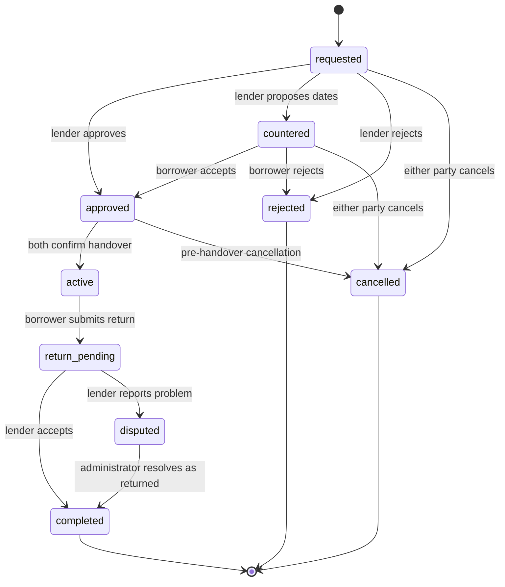

# [Project Name] Web Application Requirements and Technical Design

**Document status:** Draft 0.2  
**Date:** 2026-08-12  
**Primary implementation target:** OpenAI Codex  
**Frontend deployment:** GitHub Pages  
**Backend platform:** Supabase

## 1. Purpose

This document defines a small, responsive web application for people who own tabletop gaming material and want to lend it to other users.

Users can catalogue physical items such as miniatures, terrain, maps, dungeon tiles, books, board games, tokens, and hobby tools. Other authenticated users can request these items for an agreed period. The lender can approve, reject, or counter the requested dates. The web application tracks handover, due dates, return confirmation, reviews, and reliability.

The web application runs in a normal browser. It is not a native mobile application, does not require installation, and is not required to provide offline operation. It must still work well on phones, tablets, and desktop browsers.

Codex shall treat this document as the implementation contract. Each implementation phase must include the required database migration, Row Level Security policies, frontend behavior, tests, and documentation.

## 2. Product Definition and Scope

### 2.1 Deployment model

The system consists of:

- A static React web frontend built with Vite and deployed to GitHub Pages.
- Supabase Auth for Discord login and session management.
- Supabase Postgres for application data.
- Supabase Storage for photos.
- Supabase Edge Functions and Cron for scheduled reminders and trusted server-side operations.
- Optional Supabase Realtime updates for notifications and loan changes.

GitHub Pages does not contain application secrets and does not run backend code. All trusted operations run in Supabase.

### 2.2 MVP assumptions

The first release uses these assumptions:

1. Discord is the only authentication provider.
2. All inventory and user profiles are visible only to authenticated users.
3. A loan request can contain one or more items, but all items in one request must have the same lender.
4. An item is lent as one complete registered unit. Its component list documents the contents but does not support lending individual components in the MVP.
5. The borrower proposes a start date and due date.
6. The lender can approve, reject, or propose different dates.
7. Physical exchange, payment, deposits, shipping, insurance, and legal liability are outside the MVP.
8. Users arrange the physical exchange outside the web application or through an optional note attached to the loan.
9. The system stores only a coarse public region, not a public street address.
10. In-application notifications are mandatory. Browser push notifications are optional and require explicit user permission.
11. Returning an item requires a borrower return submission and lender acceptance.
12. Reviews cover integrity or item care, punctuality, and communication.
13. Missed return deadlines create automatic reliability penalties.
14. English is the initial interface language.

### 2.3 Out of scope for the MVP

- Native iOS or Android packages.
- App Store or Play Store distribution.
- Installation prompts or an installable PWA requirement.
- General offline support or offline mutation queues.
- Payments, deposits, escrow, insurance, or replacement claims.
- Shipping labels or courier integration.
- Sale, trade, or auction listings.
- Club, campaign, or organization administration.
- Public anonymous inventory browsing.
- Live location tracking or exact public addresses.
- Automated decisions about financial responsibility for loss or damage.
- Lending selected components from a larger registered set.
- A full moderation dashboard.

## 3. Users and Roles

### 3.1 Visitor

A visitor can:

- Open the landing page.
- Read a short description of the service.
- Start Discord login.

A visitor cannot view inventory, profiles, loans, reviews, or notifications.

### 3.2 Authenticated user

An authenticated user can act as both lender and borrower. The user can:

- Maintain a profile and notification settings.
- Add, edit, publish, hide, and archive owned items.
- Browse and search published items from other users.
- Request items for a specified period.
- Approve, reject, or counter incoming requests for owned items.
- Confirm handover and return actions.
- View borrowed and lent items in separate dashboard sections.
- Request an extension to an active loan.
- Submit a review after a completed loan.
- View reliability information for other users.

### 3.3 System

The system can:

- Create a profile after first login.
- Validate loan state transitions.
- Prevent conflicting approved loans.
- Create reminders and overdue events.
- Recalculate reliability scores.
- Preserve an audit trail for each loan.

### 3.4 Administrator

A Supabase administrator can resolve exceptional disputes and remove abusive content. A dedicated administrator interface is not required for the MVP.

## 4. Core User Workflows

### 4.1 Registration and onboarding

1. A visitor selects **Continue with Discord**.
2. Supabase starts Discord OAuth.
3. After successful authentication, the user returns to the GitHub Pages site.
4. On first login, the user completes a short profile:
   - Display name.
   - Public region.
   - Time zone.
   - Reminder lead time in days.
5. The user enters the authenticated home page.

### 4.2 Registering an item

1. The owner opens **My Inventory**.
2. The owner creates an item as a draft.
3. The owner enters the basic information, photos, contents, condition, damage, and lending rules.
4. The owner reviews the listing.
5. The owner publishes the item.
6. Other authenticated users can find the item while it is published and available.

### 4.3 Requesting a loan

1. A borrower opens a published item.
2. The borrower selects one or more items from the same lender.
3. The borrower proposes a start date and due date and may add a note.
4. The lender receives a notification.
5. The lender approves, rejects, or counters the dates.
6. When both parties accept the dates, the loan becomes approved and the items are reserved.

### 4.4 Handover and active loan

1. The lender confirms that the items were handed over.
2. The borrower confirms that the items were received.
3. The loan becomes active after both confirmations.
4. Both users see the loan on their dashboard.
5. Scheduled reminders are created before the due date and at the due time.

### 4.5 Extension

1. The borrower proposes a new due date before or after the current due date.
2. The lender approves or rejects the extension.
3. An approved extension replaces the previous due date for future reminders and overdue calculation.
4. An extension approved after an overdue penalty was created does not remove that penalty automatically. An administrator can correct an exceptional case.

### 4.6 Return

1. The borrower selects **Mark as returned**.
2. The borrower confirms the returned items, return time, condition, damage, and missing content.
3. The loan becomes return pending.
4. The lender reviews the return submission.
5. The lender accepts the return or reports a problem.
6. Acceptance completes the loan. A reported problem changes the loan to disputed.
7. The review period opens after completion.

The borrower return submission is the borrower's acceptance of the return state. The lender acceptance is the second required confirmation.

### 4.7 Review and reliability

1. After completion, each party can review the other.
2. Reviews contain ratings and an optional comment.
3. Reviews remain hidden until both parties submit or the review period closes.
4. The system combines review ratings with automatic deadline events.
5. Updated reliability information appears on the user's profile.

## 5. Functional Requirements

## 5.1 Authentication

### AUTH-001 Discord login

The web application shall provide a **Continue with Discord** action that calls Supabase OAuth with the Discord provider.

### AUTH-002 OAuth return

After Discord authentication, the user shall return to the configured GitHub Pages base URL. The frontend shall restore the Supabase session before it renders protected content.

### AUTH-003 First-login profile

A database trigger or trusted function shall create a profile after the first successful login. Available Discord metadata may initialise the display name and avatar.

### AUTH-004 Session persistence

The frontend shall persist the Supabase browser session and react to login, token refresh, and logout events.

### AUTH-005 Protected pages

Unauthenticated users shall not access inventory, profiles, loans, reviews, or notifications.

### AUTH-006 Logout

The user shall be able to log out. Logout shall clear user-specific cached data.

## 5.2 Profile and settings

### PROF-001 Profile fields

A profile shall contain:

- Display name, required, 2 to 50 characters.
- Avatar URL, optional.
- Short biography, optional, maximum 500 characters.
- Country code, optional.
- Public region or city, optional, maximum 100 characters.
- IANA time zone, required.
- Reminder lead time in days, required, integer from 0 through 30, default 2.
- Browser push enabled, default false.
- Account status.
- Created and updated timestamps.

### PROF-002 Public profile

An authenticated user can see:

- Display name and avatar.
- Public region.
- Member-since date.
- Published items.
- Completed loan count.
- Reliability score and confidence label.
- Revealed reviews.

The profile shall not expose an email address, Discord access token, exact address, or notification subscription data.

### PROF-003 Reminder setting

The user shall be able to define how many days before the due date the primary reminder is created. A value of 0 disables the advance reminder but not the due-time notification.

### PROF-004 Account deletion

A user cannot delete the account while an approved, active, return-pending, or disputed loan exists. Historical completed loans shall retain anonymised references where required for audit integrity.

## 5.3 Inventory

### ITEM-001 Item states

An item shall use one of these states:

- `draft`
- `published`
- `unavailable`
- `archived`

Only published items are visible in browse results. Archived items remain visible in historical loan records.

### ITEM-002 Required fields

An item shall contain:

- Title, 3 to 120 characters.
- Description, 10 to 5000 characters.
- Category.
- Overall condition.
- Public handover region.
- Owner.
- State.
- Created and updated timestamps.

### ITEM-003 Suggested general fields

The editor should support:

- Game system.
- Manufacturer or publisher.
- Product line, faction, or setting.
- Edition or release.
- Language.
- Tags.
- Quantity of complete sets.
- Included accessories.
- Missing parts.
- Existing damage summary.
- Fragile item flag.
- Packing or transport instructions.
- Minimum notice before a loan.
- Maximum loan duration.
- Informational replacement value and currency.
- Private owner inventory reference.

### ITEM-004 Categories

Initial categories:

- Miniatures.
- Terrain.
- Maps.
- Dungeon tiles.
- Books.
- Board games.
- Role-playing accessories.
- Tokens and markers.
- Hobby tools and equipment.
- Other.

### ITEM-005 Category-specific suggestions

**Miniatures**

- Scale.
- Faction or army.
- Model count.
- Material.
- Assembled state.
- Painted state.
- Base size.
- Transport tray included.

**Terrain**

- Dimensions.
- Piece count.
- Material.
- Modular set indicator.
- Fragility notes.

**Maps and dungeon tiles**

- Physical dimensions.
- Grid type and grid size.
- Tile or sheet count.
- Double-sided indicator.
- Theme or environment.
- Storage method.

**Books**

- ISBN, optional.
- Edition.
- Language.
- Hardcover or softcover.
- Annotation state.
- Digital code already used indicator.

**Board games and accessories**

- Edition.
- Expansion indicator.
- Player count.
- Sleeved card indicator.
- Token, card, and miniature counts.

### ITEM-006 Photos

An item shall support up to 10 photos. One photo can be the cover image. Photos shall be stored in Supabase Storage, not as database binary data.

The client should resize large images before upload. Allowed formats are JPEG, PNG, and WebP. The maximum original upload size is 10 MB.

### ITEM-007 Contents list

An item shall support a structured contents list. Each entry shall contain:

- Name.
- Optional description.
- Quantity.
- Unit label, optional.
- Condition.
- Existing damage or missing-state note.
- Optional photo.
- Sort order.

Example contents:

- 24 stone dungeon tiles.
- 10 skeleton miniatures.
- 1 rulebook.
- 2 reference sheets.
- 8 objective tokens.

The contents list is descriptive in the MVP. Individual entries are not separately lendable.

### ITEM-008 Damage records

The owner shall be able to record separate damage entries with:

- Damage type.
- Severity.
- Description.
- Affected content entry, optional.
- Evidence photos, optional.
- Discovery date, optional.
- Resolved state and repair note, optional.

Suggested damage types:

- Paint chip.
- Scratch.
- Bent part.
- Broken part.
- Missing part.
- Torn page.
- Water damage.
- Marking or annotation.
- Warping.
- Other.

Suggested severity values:

- Cosmetic.
- Minor.
- Major.
- Unusable.

### ITEM-009 Availability

The owner shall be able to:

- Mark an item unavailable without archiving it.
- Add unavailable date ranges.
- Define a maximum loan duration.

The system shall consider approved and active loans and owner-defined unavailable ranges before approval.

### ITEM-010 Deletion

An item with loan history shall not be physically deleted. It shall be archived. An unused draft may be permanently deleted after confirmation.

## 5.4 Browse and search

### DISC-001 Browse access

Authenticated users shall be able to browse published items owned by other active users.

### DISC-002 Search

Search shall match at least:

- Title.
- Description.
- Game system.
- Manufacturer or publisher.
- Tags.
- Contents entry names.

### DISC-003 Filters

The browse page shall support:

- Category.
- Game system.
- Public region.
- Overall condition.
- Desired date range.
- Available now.
- Language where applicable.

### DISC-004 Item detail

The item detail page shall show:

- Photo gallery.
- Title and description.
- Category and category-specific details.
- Condition and known damage.
- Contents list.
- Public handover region.
- Lending rules.
- Availability for the selected period.
- Lender summary and reliability.
- Request action.

## 5.5 Loan requests and date agreement

### LOAN-001 Request eligibility

A borrower can request an item only when:

- The item is published.
- The borrower is not the owner.
- The borrower and owner accounts are active.
- The requested start is before the requested due date.
- The duration satisfies the item's lending rules.

### LOAN-002 Multi-item request

A request may contain one or more complete items. All items shall have the same owner.

### LOAN-003 Initial request

The borrower shall provide:

- Selected items.
- Proposed start date and time.
- Proposed due date and time.
- Optional note, maximum 2000 characters.

The system shall create the request with status `requested`.

### LOAN-004 Lender response

The lender shall be able to:

- Approve the proposed dates.
- Reject the request with an optional reason.
- Counter with different dates and an optional note.

### LOAN-005 Counter acceptance

A lender counteroffer shall not reserve the item until the borrower accepts it. The borrower can accept or reject the counteroffer.

### LOAN-006 Reservation

When dates are accepted, the loan shall become `approved` and the selected items shall be reserved for the agreed period.

### LOAN-007 Conflict prevention

The approval operation shall run as one trusted database transaction. It shall fail if an affected item overlaps an approved, active, or return-pending loan for the same period.

Pending requests may overlap. Only an approved agreement creates a reservation.

### LOAN-008 Cancellation

Before handover, either party can cancel a requested, countered, or approved loan. An active loan must use the return process.

### LOAN-009 Audit events

The system shall create an immutable event for:

- Request creation.
- Approval.
- Rejection.
- Counteroffer.
- Counter acceptance or rejection.
- Cancellation.
- Handover confirmation.
- Extension request and response.
- Return submission.
- Return acceptance or dispute.
- Completion.
- Automatic overdue penalty.

## 5.6 Handover and active loans

### HAND-001 Handover condition

Before or during handover, the lender can record a condition note and optional photos. The borrower can report a discrepancy before confirming receipt.

### HAND-002 Two-party handover

The lender shall confirm handover and the borrower shall confirm receipt. The loan becomes `active` after both confirmations.

### HAND-003 Historical snapshot

At activation, the system shall store a snapshot of item titles, contents, known damage, and agreed dates. Later edits to the item listing shall not change the loan history.

### HAND-004 Loan dashboards

The authenticated home page shall separately show:

- Items the user is lending.
- Items the user is borrowing.
- Requests requiring action.
- Upcoming due dates.
- Overdue loans.

## 5.7 Extension and overdue behavior

### EXT-001 Extension request

An active borrower can propose a later due date and an optional reason.

### EXT-002 Extension response

The lender can approve or reject the extension. Approval shall check for reservation conflicts.

### EXT-003 Overdue definition

A loan is overdue when:

- Its status is `active` or `return_pending`.
- The agreed due time has passed.
- No approved extension replaced the due time.
- The borrower has not submitted the return.

Overdue is a derived condition, not the primary loan status.

### EXT-004 Stop point for lateness

Borrower lateness stops at `return_submitted_at`. A slow lender response shall not continue to increase the borrower penalty unless the lender disputes the claimed return time.

## 5.8 Return and completion

### RET-001 Return submission

The borrower shall submit:

- Claimed physical return time.
- Confirmation that every loan item was returned.
- Current condition note.
- New damage or missing-content note.
- Optional evidence photos.

The loan shall become `return_pending`.

### RET-002 Lender acceptance

The lender shall inspect the return submission and either:

- Accept the return.
- Report a discrepancy or damage issue.

### RET-003 Completion

The loan shall become `completed` only when:

- The borrower submitted the return.
- The lender accepted it.
- No unresolved discrepancy exists.

### RET-004 Dispute

If the lender reports a discrepancy, the loan shall become `disputed`. The system shall preserve both parties' notes and evidence. An administrator can resolve the dispute in the MVP.

### RET-005 Review availability

Reviews become available only after the loan reaches `completed`.

## 5.9 Notifications

### NOTIF-001 Notification inbox

The web application shall provide a notification page and an unread count.

Each notification shall contain:

- Recipient.
- Type.
- Short text.
- Created timestamp.
- Read timestamp, optional.
- Link to the relevant item, request, or loan.
- Deduplication key.

### NOTIF-002 Required events

Create notifications for at least:

- New loan request.
- Request approved.
- Request rejected.
- Counteroffer received.
- Counteroffer accepted or rejected.
- Handover confirmation required.
- Configured advance due reminder.
- Due time reached.
- Loan became overdue.
- Extension requested, approved, or rejected.
- Return confirmation required.
- Return disputed.
- Loan completed.
- Review available.

### NOTIF-003 Reminder lead time

For each active loan, the system shall create an advance reminder at:

```text
agreed_due_at - profile.reminder_lead_days
```

If the calculated reminder time is earlier than the activation time, the reminder shall be created immediately after activation.

### NOTIF-004 Due-time notification

Both parties shall receive a notification when the agreed due time is reached, even when the advance reminder setting is 0.

### NOTIF-005 Scheduled processing

A Supabase Cron job shall run at least hourly and call a trusted database function or Edge Function that:

- Finds reminders that are due.
- Creates due-time notifications.
- Detects new overdue loans.
- Creates automatic reliability events.
- Uses deterministic deduplication keys.

Re-running the job shall not create duplicate notifications or penalties.

### NOTIF-006 Browser push

Browser push notifications are optional. When implemented:

- The user must grant permission explicitly.
- Push content shall contain only a short message and a link.
- Private descriptions, addresses, condition evidence, and review text shall not appear in push payloads.
- A minimal service worker may be used only for push handling. The web application is still not required to be installable or work offline.

## 5.10 Reviews

### REV-001 Eligibility

Each party can submit one review of the other party after a completed loan.

### REV-002 Review period

The review period shall remain open for 14 days after completion.

### REV-003 Borrower review dimensions

The lender reviewing the borrower shall rate:

- Item care and integrity, 1 through 5.
- Punctuality, 1 through 5.
- Communication, 1 through 5.

### REV-004 Lender review dimensions

The borrower reviewing the lender shall rate:

- Listing and condition accuracy, 1 through 5.
- Punctuality, 1 through 5.
- Communication, 1 through 5.

### REV-005 Comment

A review may contain one plain-text comment of up to 1000 characters.

### REV-006 Blind reveal

A submitted review remains hidden until:

- Both parties have submitted a review, or
- The 14-day review period ends.

A user shall not see the other party's review before the reveal condition is met.

## 5.11 Reliability score

### SCORE-001 Presentation

A profile shall show:

- Combined reliability score from 0 through 100.
- Borrower score.
- Lender score.
- Completed loan count.
- Confidence label.
- Review averages.
- Recent automatic penalty explanations without private loan details.

### SCORE-002 New-user state

A user with fewer than three completed loans shall display `New` instead of a definitive public numeric score.

### SCORE-003 Review component

For each role, calculate a Bayesian mean of revealed ratings:

```text
bayesian_rating = (sum_of_ratings + prior_rating * prior_weight)
                  / (rating_count + prior_weight)
```

Use:

- `prior_rating = 4.0`
- `prior_weight = 5`
- `review_component = bayesian_rating * 20`

Clamp the result from 0 through 100.

### SCORE-004 Automatic component

The automatic component starts at 100. It uses penalty events from the previous 365 days.

Initial borrower late-return penalties:

| Final lateness | Penalty |
| --- | ---: |
| Up to 12 hours | 0 |
| More than 12 hours through 2 days | -5 |
| More than 2 days through 4 days | -10 |
| More than 4 days through 7 days | -20 |
| More than 7 days | -35 |

Initial lender response penalty:

| Event | Penalty |
| --- | ---: |
| No response to a return submission for more than 72 hours | -5 |

For one late loan, the system shall maintain one final lateness penalty. It shall not add a new penalty for every crossed threshold.

```text
automatic_component = clamp(100 + sum(active_penalty_points), 0, 100)
```

### SCORE-005 Role score

```text
role_score = round(0.80 * review_component + 0.20 * automatic_component)
```

### SCORE-006 Combined score

The combined score shall be the completed-loan-count-weighted mean of the borrower and lender role scores. When only one role has qualifying history, the combined score equals that role score.

### SCORE-007 Confidence

- `New`: 0 through 2 completed loans.
- `Low`: 3 through 5 completed loans.
- `Medium`: 6 through 14 completed loans.
- `High`: 15 or more completed loans.

### SCORE-008 Trusted calculation

The browser shall not insert, update, or delete reliability scores or automatic reliability events directly. Only trusted database functions, scheduled jobs, or administrator actions can change them.

## 6. Loan State Model

Primary loan states:

- `requested`
- `countered`
- `approved`
- `active`
- `return_pending`
- `completed`
- `rejected`
- `cancelled`
- `disputed`

`overdue` is calculated from the due time and return state.



The frontend shall not update `loans.status` directly. Trusted Postgres functions shall validate and apply state transitions.

## 7. Data Model

All primary keys use UUIDs. All timestamps use `timestamptz` and are stored in UTC. The frontend displays timestamps in the user's configured IANA time zone.

### 7.1 `profiles`

Important fields:

- `id`, references `auth.users`.
- `display_name`.
- `avatar_url`.
- `bio`.
- `country_code`.
- `public_region`.
- `time_zone`.
- `reminder_lead_days`.
- `push_enabled`.
- `status`.
- `created_at`.
- `updated_at`.

### 7.2 `items`

Important fields:

- `id`.
- `owner_id`.
- `status`.
- `title`.
- `description`.
- `category`.
- `overall_condition`.
- `condition_notes`.
- `game_system`.
- `manufacturer`.
- `product_line`.
- `edition`.
- `language_code`.
- `tags`.
- `attributes jsonb` for category-specific values.
- `public_region`.
- `fragile`.
- `minimum_notice_hours`.
- `maximum_loan_days`.
- `replacement_value_minor`.
- `replacement_currency`.
- `lending_notes`.
- `created_at`.
- `updated_at`.
- `archived_at`.

### 7.3 `item_photos`

Important fields:

- `id`.
- `item_id`.
- `storage_path`.
- `alt_text`.
- `sort_order`.
- `is_cover`.
- `created_at`.

### 7.4 `item_contents`

Important fields:

- `id`.
- `item_id`.
- `name`.
- `description`.
- `quantity`.
- `unit_label`.
- `condition`.
- `damage_notes`.
- `photo_path`.
- `sort_order`.

### 7.5 `item_damage`

Important fields:

- `id`.
- `item_id`.
- `item_content_id`, optional.
- `damage_type`.
- `severity`.
- `description`.
- `discovered_at`.
- `resolved_at`.
- `repair_note`.
- `created_at`.
- `updated_at`.

### 7.6 `item_unavailable_periods`

Important fields:

- `id`.
- `item_id`.
- `starts_at`.
- `ends_at`.
- `reason`.
- `created_at`.

Constraint: `ends_at > starts_at`.

### 7.7 `loans`

Important fields:

- `id`.
- `owner_id`.
- `borrower_id`.
- `status`.
- `agreed_start_at`.
- `agreed_due_at`.
- `handover_owner_confirmed_at`.
- `handover_borrower_confirmed_at`.
- `started_at`.
- `return_submitted_at`.
- `return_accepted_at`.
- `completed_at`.
- `cancelled_at`.
- `disputed_at`.
- `created_at`.
- `updated_at`.
- `version` for optimistic concurrency checks.

Constraints:

- `owner_id <> borrower_id`.
- Agreed due time is later than agreed start time.

### 7.8 `loan_items`

Important fields:

- `id`.
- `loan_id`.
- `item_id`.
- `item_snapshot jsonb`.
- `created_at`.

Every item in a loan shall belong to `loans.owner_id`.

### 7.9 `loan_date_proposals`

Important fields:

- `id`.
- `loan_id`.
- `proposed_by`.
- `starts_at`.
- `due_at`.
- `note`.
- `status`.
- `created_at`.
- `responded_at`.

Only one proposal can be pending for a loan.

### 7.10 `loan_condition_reports`

Important fields:

- `id`.
- `loan_id`.
- `report_type`, `handover` or `return`.
- `created_by`.
- `condition_note`.
- `damage_note`.
- `missing_content_note`.
- `claimed_event_at`.
- `created_at`.

Evidence photos are stored in a private Storage bucket and linked through a separate media table.

### 7.11 `loan_events`

Important fields:

- `id`.
- `loan_id`.
- `event_type`.
- `actor_id`, optional for system events.
- `event_data jsonb`.
- `created_at`.

Normal users cannot update or delete event rows.

### 7.12 `reviews`

Important fields:

- `id`.
- `loan_id`.
- `reviewer_id`.
- `reviewee_id`.
- `reviewer_role`.
- Three rating fields.
- `comment`.
- `submitted_at`.
- `visible_at`.
- `hidden_by_admin`.

Constraints:

- One review per reviewer and loan.
- Reviewer and reviewee are different users.
- The loan is completed.

### 7.13 `notifications`

Important fields:

- `id`.
- `user_id`.
- `type`.
- `title`.
- `body`.
- `target_path`.
- `deduplication_key`.
- `created_at`.
- `read_at`.

Constraint: unique `deduplication_key` per user.

### 7.14 Reliability tables

Use private automatic event data and a public score snapshot.

`reliability_events`:

- `id`.
- `user_id`.
- `loan_id`.
- `role`.
- `event_type`.
- `points`.
- `occurred_at`.
- `expires_at`.
- `voided_at`.

`reliability_scores`:

- `user_id`.
- `borrower_score`.
- `lender_score`.
- `combined_score`.
- `completed_as_borrower`.
- `completed_as_lender`.
- `confidence`.
- `calculated_at`.

### 7.15 Optional `push_subscriptions`

Required only when browser push is implemented.

- `id`.
- `user_id`.
- `endpoint`.
- Encrypted subscription keys.
- `created_at`.
- `revoked_at`.

## 8. Trusted Database Operations

Use Postgres functions or Edge Functions for operations that change several rows or enforce business rules.

Required trusted operations:

- `create_loan_request`.
- `counter_loan_dates`.
- `approve_loan`.
- `reject_loan`.
- `cancel_loan`.
- `confirm_handover`.
- `request_extension`.
- `respond_to_extension`.
- `submit_return`.
- `accept_return`.
- `dispute_return`.
- `submit_review`.
- `recalculate_reliability`.
- `process_due_notifications`.

The browser shall not directly write:

- Loan status.
- Agreed dates.
- Completion timestamps.
- Review visibility timestamps.
- Reliability events.
- Reliability scores.

Approval and extension acceptance shall use transactions and row-level locks to prevent double booking.

## 9. Authorization and Security

### 9.1 General rule

Enable Row Level Security on every exposed table. The frontend uses only the Supabase project URL and publishable key.

Never expose the service-role key, Discord client secret, push private key, or any other trusted secret in the GitHub Pages build.

### 9.2 Policy summary

**Profiles**

- Authenticated users can read active public profiles.
- Users can update only their own permitted profile fields.

**Items, photos, contents, damage, and unavailable periods**

- Authenticated users can read published items and related public data.
- Owners can read all their own items.
- Owners can create and edit only their own items.
- Historical snapshots remain available to loan parties.

**Loans, proposals, reports, and events**

- Only the lender, borrower, and administrator can read a loan.
- Clients use trusted operations for state changes.
- Loan events are append-only.

**Reviews**

- A reviewer can read their submitted review before reveal.
- The reviewee cannot read hidden review content.
- Authenticated users can read revealed, non-hidden reviews.
- Reviews are inserted through a trusted function.

**Notifications**

- A user can read and mark only their own notifications as read.
- Notification creation is trusted server-side behavior.

**Reliability**

- Authenticated users can read public score snapshots.
- Normal client roles cannot write reliability events or scores.

### 9.3 Storage buckets

Use separate buckets:

1. `item-photos`
   - Authenticated read for photos connected to visible items.
   - Owner-only write under an owner-specific path.

2. `loan-evidence`
   - Private.
   - Read only by the lender, borrower, and administrator for the related loan.
   - Signed URLs or strict object policies.

3. `profile-photos`
   - Authenticated read.
   - Owner-only write.

### 9.4 Content safety

- Render user text as plain text, not raw HTML.
- Validate image MIME type and size.
- Use generated Storage object names.
- Do not trust the original filename.
- Do not log OAuth tokens, private evidence URLs, or exact exchange details.

## 10. Frontend Design

### 10.1 Required technology

- React.
- TypeScript with strict mode.
- Vite.
- Supabase JavaScript client.
- React Router with `HashRouter`.
- TanStack Query for remote state.
- React Hook Form and Zod for forms and validation.
- Vitest and Testing Library.
- Playwright for core end-to-end tests.

Codex shall avoid unnecessary dependencies.

### 10.2 Routes

Suggested routes:

- `#/login`
- `#/onboarding`
- `#/home`
- `#/browse`
- `#/inventory`
- `#/items/new`
- `#/items/:itemId`
- `#/items/:itemId/edit`
- `#/requests`
- `#/loans`
- `#/loans/:loanId`
- `#/notifications`
- `#/users/:userId`
- `#/settings`
- `#/help/reliability`

Use hash routing because GitHub Pages does not provide arbitrary SPA route rewrites.

### 10.3 Main pages

**Landing and login**

- Product description.
- Discord login action.
- Privacy and terms links.
- OAuth error state.

**Onboarding**

- Display name.
- Region.
- Time zone.
- Reminder lead time.

**Home**

- Incoming requests that need action.
- Borrowed items.
- Lent items.
- Upcoming due dates.
- Overdue warnings.

**My Inventory**

- Draft, published, unavailable, and archived filters.
- Add item action.
- Edit and availability actions.

**Item editor**

Use clear sections rather than an app-style wizard:

1. Basic information.
2. Category details.
3. Photos.
4. Contents.
5. Condition and damage.
6. Lending rules and availability.
7. Review and publish.

**Browse**

- Search input.
- Filters.
- Responsive card or table layout.
- Loading, empty, and error states.

**Item detail**

- Photo gallery.
- Description and attributes.
- Contents and damage.
- Lender information.
- Availability and request action.

**Requests**

- Incoming requests.
- Sent requests.
- Requests that need action.
- Closed requests.

**Loan detail**

- Current status.
- Agreed dates.
- Item snapshot.
- Event timeline.
- Handover actions.
- Extension action.
- Return action.
- Due and overdue information.

**Notifications**

- Unread and all filters.
- Mark one or all as read.
- Links to affected records.

**Profile**

- Published inventory.
- Reliability summary.
- Completed transaction count.
- Revealed reviews.

### 10.4 Responsive behavior

The web application shall support viewport widths from 360 pixels upward.

- No core page shall require horizontal scrolling.
- Forms shall use a single column on narrow screens and wider grouped layouts on desktop.
- Primary actions shall remain visible and reachable with touch.
- Tables shall collapse to cards or labelled rows on narrow screens.
- Navigation can use a compact menu on narrow screens and a top navigation bar on wider screens.

### 10.5 Accessibility

Target WCAG 2.2 AA for core workflows.

Required behavior:

- Keyboard access.
- Visible focus.
- Semantic headings and labels.
- Sufficient contrast.
- Form errors associated with fields.
- Status changes communicated in text.
- No status communicated only by colour.
- Descriptive image alternative text where relevant.

### 10.6 Error handling

Every mutation shall show:

- Pending state.
- Success confirmation.
- User-correctable validation errors.
- Clear authorization or conflict messages.
- Retry for temporary network failures.

The frontend shall not expose raw database error messages.

## 11. GitHub Pages and Supabase Configuration

### 11.1 GitHub Pages deployment

Use a GitHub Actions workflow that:

1. Checks out the repository.
2. Installs the pinned Node.js version.
3. Installs dependencies with the lockfile.
4. Runs type checking, linting, unit tests, and the production build.
5. Uploads the static build directory as the Pages artifact.
6. Deploys the artifact with the official GitHub Pages deployment action.

### 11.2 Repository base path

The Vite build shall support a repository subpath such as:

```text
https://<account>.github.io/<repository>/
```

Required frontend variables:

```text
VITE_SUPABASE_URL=
VITE_SUPABASE_PUBLISHABLE_KEY=
VITE_SITE_URL=https://<account>.github.io/<repository>/
VITE_BASE_PATH=/<repository>/
```

These frontend values are public configuration. They are not secrets.

For a custom domain, `VITE_BASE_PATH` can be `/`.

### 11.3 Discord OAuth configuration

Configure:

- A Discord application.
- The Discord OAuth callback URL as the Supabase Auth callback URL:

```text
https://<supabase-project-ref>.supabase.co/auth/v1/callback
```

- Discord client ID and client secret in Supabase Auth provider settings.
- Supabase Site URL as the production GitHub Pages base URL.
- Supabase allowed redirect URLs for the production site and local development.

The frontend shall call Discord OAuth with an explicit `redirectTo` that points to the GitHub Pages base URL.

### 11.4 Local development

Use:

- Vite development server.
- A local `.env.local` file that is excluded from Git.
- Supabase local development or a dedicated development project.
- A localhost OAuth redirect URL in the Supabase allow list.

### 11.5 No server assumptions

The frontend shall not require:

- Node.js at runtime on GitHub Pages.
- Server-side rendering.
- API routes hosted by GitHub Pages.
- Filesystem persistence.
- Private environment variables in the static build.

## 12. Testing Requirements

### 12.1 Unit tests

Test at least:

- Date range validation.
- Overlap detection helpers.
- Reminder time calculation.
- Overdue calculation.
- Reliability formulas.
- Penalty thresholds.
- Category-specific item validation.

### 12.2 Component tests

Test at least:

- Item form validation.
- Request and counteroffer forms.
- Dashboard sections.
- Return submission and acceptance.
- Notification read state.
- Reliability presentation for new and established users.

### 12.3 Database and RLS tests

Test at least:

- A user cannot edit another user's item.
- An unrelated user cannot read a loan or private evidence.
- A user cannot approve a loan they do not own.
- A user cannot request their own item.
- Hidden review content is not readable by the reviewee.
- Normal users cannot write reliability data.
- A conflicting approval fails atomically.
- Duplicate scheduled processing does not create duplicate notifications or penalties.

### 12.4 End-to-end tests

Required scenarios:

1. New user completes onboarding.
2. Owner creates and publishes an item with photos, contents, and damage.
3. Borrower searches for the item and submits a request.
4. Lender counters the dates and borrower accepts.
5. Both parties confirm handover.
6. The loan appears in borrowed and lent dashboards.
7. A due reminder is created.
8. Borrower submits the return and lender accepts it.
9. Both parties submit reviews.
10. Reviews reveal and reliability recalculates.
11. A conflicting second approval fails.
12. A return discrepancy creates a disputed loan.

### 12.5 Manual release checks

Before release, verify:

- Discord OAuth on the production GitHub Pages URL.
- GitHub Pages repository base-path behavior.
- Desktop and mobile browser layouts.
- Photo upload from desktop and mobile browsers.
- Browser refresh on every hash route.
- No secret appears in the build output.
- Optional browser push denied, granted, and revoked behavior when push is implemented.

## 13. MVP Acceptance Criteria

### AC-001 Login

Given a logged-out visitor, when the visitor completes Discord OAuth, the visitor returns to the GitHub Pages site with a valid Supabase session and sees onboarding or the authenticated home page.

### AC-002 Inventory

Given an authenticated owner, when the owner creates an item with photos, contents, condition, and damage, the owner can save it as a draft and publish it later.

### AC-003 Browse

Given a published item, when another authenticated user searches by title, tag, game system, or contents name, the item can appear in the results.

### AC-004 Request

Given an available item, when a borrower submits valid dates, the lender receives a request notification and can inspect the requested items and dates.

### AC-005 Date agreement

Given a pending request, when the lender counters and the borrower accepts, the accepted dates become the agreed dates and the items are reserved.

### AC-006 Conflict prevention

Given two overlapping pending requests, when one is approved and the other conflicts, the second approval fails without partial changes.

### AC-007 Handover

Given an approved loan, when both parties confirm handover, the loan becomes active and stores an immutable item snapshot.

### AC-008 Overview

Given an active loan, the lender sees it under lent items and the borrower sees it under borrowed items.

### AC-009 Reminders

Given an active loan and a user's reminder setting, when the reminder time and due time are reached, exactly one notification for each event is created for that user.

### AC-010 Return

Given an active loan, when the borrower submits the return and the lender accepts it, the loan becomes completed.

### AC-011 Two-party return rule

Given only a borrower return submission, the loan remains return pending and does not become completed.

### AC-012 Review

Given a completed loan, both parties can submit one review. Hidden reviews become visible only after both submit or the review period ends.

### AC-013 Reliability

Given revealed reviews and a late-return event, the reliability calculation uses the documented formulas and penalty band.

### AC-014 Security

Given an unrelated authenticated user, attempts to read another pair's private loan, evidence, or hidden review are denied by the database.

### AC-015 GitHub Pages

Given a production build deployed below a repository subpath, the site, assets, hash routes, and OAuth return work after direct navigation and browser refresh.

## 14. Implementation Plan for Codex

### Phase 0: Foundation

- Create the React, TypeScript, and Vite project.
- Enable strict TypeScript.
- Add formatting, linting, unit tests, and path aliases.
- Add `HashRouter` and the responsive site layout.
- Add Supabase project structure and migrations.
- Add GitHub Actions CI and Pages deployment.
- Add environment validation and README setup instructions.

### Phase 1: Authentication and profiles

- Configure Supabase Discord Auth integration points.
- Add session management and protected routes.
- Add the profile creation trigger.
- Add onboarding and settings.
- Add profile RLS policies and tests.

### Phase 2: Inventory and browse

- Add item, photo, contents, damage, and unavailable-period tables.
- Add Storage buckets and policies.
- Add inventory pages and item editor.
- Add category-specific validation.
- Add browse, search, filters, and item detail.
- Add inventory and Storage tests.

### Phase 3: Loan requests and handover

- Add loan, loan item, proposal, event, and condition report tables.
- Add request, counteroffer, approval, rejection, and cancellation functions.
- Add conflict-safe reservations.
- Add request pages and loan detail.
- Add handover confirmations and item snapshots.
- Add RLS, transaction, and end-to-end tests.

### Phase 4: Return and notifications

- Add extension operations.
- Add return submission, acceptance, and dispute behavior.
- Add the notifications table and notification page.
- Add Supabase Cron processing for reminders and overdue events.
- Add notification deduplication tests.
- Add optional browser push only after in-application notifications work.

### Phase 5: Reviews and reliability

- Add blind reviews.
- Add reliability event and score tables.
- Implement the formulas exactly as specified.
- Add profile score explanations.
- Add review and score tests.

### Phase 6: Hardening and release

- Complete accessibility review.
- Complete desktop and mobile browser checks.
- Verify RLS for every exposed table.
- Verify that no secret is present in the static build.
- Add production configuration documentation.
- Run all acceptance scenarios.

## 15. Codex Engineering Rules

1. Treat this document as the product contract.
2. Record intentional design changes in `docs/decisions/`.
3. Use migrations for every database, function, policy, trigger, enum, index, and Storage policy change.
4. Do not enforce authorization only in the frontend.
5. Do not expose a Supabase service-role key or other secret to the browser.
6. Do not let the browser write protected loan state or reliability data directly.
7. Use transactions and row locks for approval and extension conflict checks.
8. Keep loan events append-only and historical snapshots immutable.
9. Store timestamps in UTC and display them in the user's time zone.
10. Render user content as plain text.
11. Add tests with every business rule.
12. Keep the main branch buildable after each implementation phase.
13. Do not add PWA installation, offline behavior, native packaging, payments, shipping, or component-level lending unless a later decision explicitly adds them.
14. Update the README and `.env.example` whenever configuration changes.
15. Do not consider a feature complete until its loading, empty, error, success, and unauthorized states exist.

## 16. Definition of Done

A feature is complete only when:

- Its requirements and acceptance criteria are implemented.
- Its database migration is included.
- RLS policies are present and tested.
- Frontend and database validation agree.
- Responsive and keyboard behavior is verified.
- Relevant unit, component, database, and end-to-end tests pass.
- No TypeScript, lint, test, or production build error remains.
- Documentation is current.
- No secret or private data appears in the GitHub Pages build.

## 17. Product Decisions That Can Be Changed Later

The design is implementable with the defaults in Section 2. These decisions have the largest effect on later scope:

1. Allow borrowing selected contents from a registered set instead of only the complete item.
2. Restrict inventory to private groups, clubs, or invited users.
3. Add distance-based discovery instead of a text region.
4. Make browser push mandatory or add email reminders.
5. Add a user-facing dispute and moderation interface.
6. Add deposits, payments, or documented replacement-value agreements.
7. Add multiple interface languages.
8. Add private loan messaging inside the web application.
